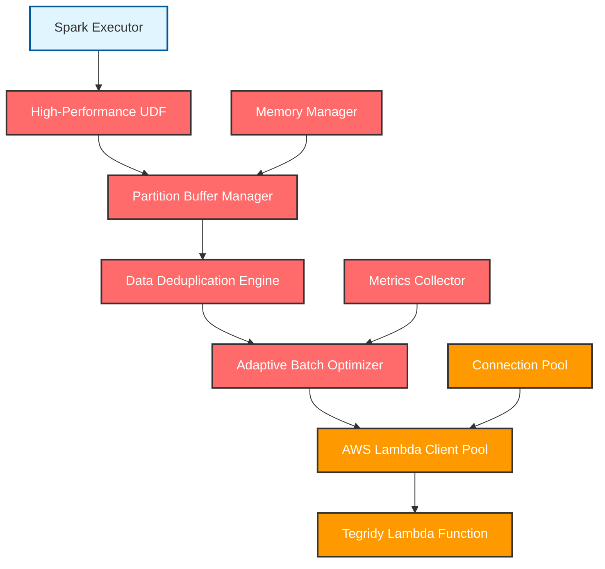

# High-Performance Tegridy Tokens UDF Design

## Overview

This document outlines the design for a high-performance Java/Scala User Defined Function (UDF) for Tegridy Tokens, specifically optimized for processing massive datasets (50GB+). The focus is exclusively on the UDF implementation, not the overall Spark job orchestration.

## Performance Requirements

### Target Specifications
- **Dataset Size**: 50GB - 1TB+ files
- **Record Count**: 100M - 10B+ records per job
- **Throughput Target**: >100,000 records/second per executor
- **Memory Efficiency**: Process with minimal memory footprint per partition
- **Lambda Efficiency**: Minimize API calls while maximizing batch utilization
- **Latency**: <100ms average processing time per partition

### Performance Constraints
- **Lambda Limits**: 6MB payload, 15-minute timeout, 1000 concurrent executions
- **Spark Memory**: Efficient memory usage to prevent OOM errors
- **Network**: Minimize data transfer between driver and executors
- **CPU**: Optimize for CPU-intensive JSON processing and AWS SDK calls

## Architecture Overview



## Core Implementation

### 1. Scala UDF Foundation

```scala
// File: src/main/scala/com/tegridy/spark/HighPerformanceTegridyUDF.scala

package com.tegridy.spark

import org.apache.spark.sql.catalyst.expressions.codegen.CodegenFallback
import org.apache.spark.sql.catalyst.expressions.{Expression, UnaryExpression}
import org.apache.spark.sql.catalyst.InternalRow
import org.apache.spark.sql.types.{DataType, StringType}
import org.apache.spark.unsafe.types.UTF8String
import software.amazon.awssdk.services.lambda.LambdaClient
import software.amazon.awssdk.core.SdkBytes
import com.fasterxml.jackson.databind.ObjectMapper
import java.util.concurrent.{ConcurrentHashMap, ThreadPoolExecutor, LinkedBlockingQueue, TimeUnit}
import scala.collection.mutable
import scala.util.{Try, Success, Failure}

/**
 * High-performance UDF for Tegridy Tokens optimized for massive datasets
 */
case class TegridyTokenizeExpression(
    child: Expression,
    lambdaFunctionName: String,
    awsRegion: String,
    batchSize: Int = 200,
    cacheSize: Int = 10000,
    timeoutMs: Int = 30000
) extends UnaryExpression with CodegenFallback {
    
    override def dataType: DataType = StringType
    override def nullable: Boolean = true
    
    // Thread-safe singleton components per executor
    @transient private lazy val tokenProcessor = TegridyTokenProcessor.getInstance(
        lambdaFunctionName, awsRegion, batchSize, cacheSize, timeoutMs
    )
    
    override def eval(input: InternalRow): Any = {
        val inputValue = child.eval(input)
        if (inputValue == null) {
            null
        } else {
            val dataString = inputValue.asInstanceOf[UTF8String].toString
            val token = tokenProcessor.tokenize(dataString)
            if (token != null) UTF8String.fromString(token) else null
        }
    }
    
    override def prettyName: String = "tegridy_tokenize_hp"
}

/**
 * Singleton token processor with advanced optimization features
 */
object TegridyTokenProcessor {
    private val instances = new ConcurrentHashMap[String, TegridyTokenProcessor]()
    
    def getInstance(functionName: String, region: String, batchSize: Int, 
                   cacheSize: Int, timeoutMs: Int): TegridyTokenProcessor = {
        val key = s"$functionName-$region-$batchSize"
        instances.computeIfAbsent(key, _ => 
            new TegridyTokenProcessor(functionName, region, batchSize, cacheSize, timeoutMs)
        )
    }
}

class TegridyTokenProcessor(
    lambdaFunctionName: String,
    awsRegion: String,
    batchSize: Int,
    cacheSize: Int,
    timeoutMs: Int
) extends Serializable {
    
    // High-performance components
    @transient private lazy val batchBuffer = new HighPerformanceBatchBuffer(batchSize, timeoutMs)
    @transient private lazy val tokenCache = new LRUTokenCache(cacheSize)
    @transient private lazy val lambdaClientPool = new LambdaClientPool(awsRegion, maxClients = 5)
    @transient private lazy val performanceMonitor = new PerformanceMonitor()
    @transient private lazy val deduplicationEngine = new DeduplicationEngine()
    
    def tokenize(data: String): String = {
        if (data == null || data.trim.isEmpty) return null
        
        // Check cache first
        tokenCache.get(data) match {
            case Some(cachedToken) => 
                performanceMonitor.recordCacheHit()
                cachedToken
            case None =>
                performanceMonitor.recordCacheMiss()
                // Add to batch buffer for processing
                batchBuffer.add(data, tokenCache, lambdaClientPool, performanceMonitor, deduplicationEngine)
        }
    }
}
```

### 2. High-Performance Batch Buffer

```scala
// File: src/main/scala/com/tegridy/spark/HighPerformanceBatchBuffer.scala

import java.util.concurrent.atomic.{AtomicInteger, AtomicLong}
import java.util.concurrent.{ConcurrentLinkedQueue, CompletableFuture, TimeUnit}
import scala.collection.mutable
import scala.concurrent.{ExecutionContext, Future, Promise}
import scala.util.{Success, Failure}

class HighPerformanceBatchBuffer(
    maxBatchSize: Int,
    timeoutMs: Int
) {
    
    // Lock-free data structures for maximum throughput
    private val pendingRequests = new ConcurrentLinkedQueue[TokenRequest]()
    private val pendingCount = new AtomicInteger(0)
    private val lastFlushTime = new AtomicLong(System.currentTimeMillis())
    
    // Adaptive batching parameters
    @volatile private var currentBatchSize = maxBatchSize
    @volatile private var avgProcessingTime = 1000.0 // milliseconds
    
    case class TokenRequest(
        data: String,
        promise: Promise[String],
        timestamp: Long = System.currentTimeMillis()
    )
    
    def add(
        data: String,
        cache: LRUTokenCache,
        clientPool: LambdaClientPool,
        monitor: PerformanceMonitor,
        deduplicator: DeduplicationEngine
    ): String = {
        
        // Create promise for async result
        val promise = Promise[String]()
        val request = TokenRequest(data, promise)
        
        // Add to queue
        pendingRequests.offer(request)
        val currentCount = pendingCount.incrementAndGet()
        
        // Check if we should flush
        val shouldFlush = shouldFlushBatch(currentCount)
        
        if (shouldFlush) {
            // Trigger async batch processing
            flushBatchAsync(cache, clientPool, monitor, deduplicator)
        }
        
        // Wait for result with timeout
        try {
            val future = promise.future
            scala.concurrent.Await.result(future, scala.concurrent.duration.Duration(timeoutMs, TimeUnit.MILLISECONDS))
        } catch {
            case _: java.util.concurrent.TimeoutException =>
                monitor.recordTimeout()
                // Fallback to immediate processing
                processImmediately(data, clientPool, monitor)
            case ex: Exception =>
                monitor.recordError(ex)
                null
        }
    }
    
    private def shouldFlushBatch(currentCount: Int): Boolean = {
        val timeSinceLastFlush = System.currentTimeMillis() - lastFlushTime.get()
        
        currentCount >= currentBatchSize || 
        timeSinceLastFlush > timeoutMs ||
        (currentCount > 10 && timeSinceLastFlush > timeoutMs / 4)
    }
    
    private def flushBatchAsync(
        cache: LRUTokenCache,
        clientPool: LambdaClientPool,
        monitor: PerformanceMonitor,
        deduplicator: DeduplicationEngine
    ): Unit = {
        
        // Collect batch atomically
        val batch = collectCurrentBatch()
        if (batch.isEmpty) return
        
        // Process asynchronously
        implicit val ec: ExecutionContext = clientPool.executionContext
        
        Future {
            processBatch(batch, cache, clientPool, monitor, deduplicator)
        }.onComplete {
            case Success(_) => monitor.recordBatchSuccess(batch.size)
            case Failure(ex) => 
                monitor.recordBatchFailure(ex)
                // Complete all promises with null
                batch.foreach(_.promise.trySuccess(null))
        }
    }
    
    private def collectCurrentBatch(): List[TokenRequest] = {
        val batch = mutable.ListBuffer[TokenRequest]()
        var collected = 0
        
        while (collected < currentBatchSize && !pendingRequests.isEmpty) {
            Option(pendingRequests.poll()) match {
                case Some(request) =>
                    batch += request
                    collected += 1
                    pendingCount.decrementAndGet()
                case None => // Queue is empty
            }
        }
        
        lastFlushTime.set(System.currentTimeMillis())
        batch.toList
    }
    
    private def processBatch(
        batch: List[TokenRequest],
        cache: LRUTokenCache,
        clientPool: LambdaClientPool,
        monitor: PerformanceMonitor,
        deduplicator: DeduplicationEngine
    ): Unit = {
        
        val startTime = System.currentTimeMillis()
        
        try {
            // Deduplicate within batch
            val uniqueData = deduplicator.deduplicate(batch.map(_.data))
            
            if (uniqueData.isEmpty) {
                batch.foreach(_.promise.trySuccess(null))
                return
            }
            
            // Call Lambda
            val client = clientPool.acquire()
            try {
                val tokenMap = invokeLambda(client, uniqueData, monitor)
                
                // Update cache
                tokenMap.foreach { case (data, token) =>
                    cache.put(data, token)
                }
                
                // Complete promises
                batch.foreach { request =>
                    val token = tokenMap.getOrElse(request.data, null)
                    request.promise.trySuccess(token)
                }
                
            } finally {
                clientPool.release(client)
            }
            
            // Update adaptive parameters
            val processingTime = System.currentTimeMillis() - startTime
            updateAdaptiveParameters(processingTime, batch.size)
            
        } catch {
            case ex: Exception =>
                monitor.recordError(ex)
                batch.foreach(_.promise.tryFailure(ex))
        }
    }
    
    private def invokeLambda(
        client: LambdaClient,
        data: List[String],
        monitor: PerformanceMonitor
    ): Map[String, String] = {
        
        val payload = Map(
            "requests" -> data.map(d => Map("data" -> d))
        )
        
        val startTime = System.currentTimeMillis()
        
        try {
            val objectMapper = new ObjectMapper()
            val request = software.amazon.awssdk.services.lambda.model.InvokeRequest.builder()
                .functionName(lambdaFunctionName)
                .payload(SdkBytes.fromUtf8String(objectMapper.writeValueAsString(payload)))
                .build()
            
            val response = client.invoke(request)
            val responsePayload = response.payload().asUtf8String()
            
            val lambdaTime = System.currentTimeMillis() - startTime
            monitor.recordLambdaCall(lambdaTime, data.size)
            
            // Parse response
            parseTokenResponse(responsePayload, objectMapper)
            
        } catch {
            case ex: Exception =>
                monitor.recordLambdaError(ex)
                throw ex
        }
    }
    
    private def parseTokenResponse(responsePayload: String, mapper: ObjectMapper): Map[String, String] = {
        try {
            val responseMap = mapper.readValue(responsePayload, classOf[java.util.Map[String, Any]])
            val responses = responseMap.get("responses").asInstanceOf[java.util.List[java.util.Map[String, Any]]]
            
            val tokenMap = mutable.Map[String, String]()
            
            responses.forEach { response =>
                val success = response.get("success").asInstanceOf[Boolean]
                if (success) {
                    val data = response.get("data").asInstanceOf[String]
                    val token = response.get("token").asInstanceOf[String]
                    if (data != null && token != null) {
                        tokenMap(data) = token
                    }
                }
            }
            
            tokenMap.toMap
        } catch {
            case ex: Exception =>
                Map.empty[String, String]
        }
    }
    
    private def updateAdaptiveParameters(processingTime: Long, batchSize: Int): Unit = {
        // Exponential moving average of processing time
        avgProcessingTime = avgProcessingTime * 0.8 + processingTime * 0.2
        
        // Adapt batch size based on performance
        val targetLatency = 2000.0 // 2 seconds
        
        if (avgProcessingTime < targetLatency * 0.5 && currentBatchSize < maxBatchSize) {
            currentBatchSize = math.min(maxBatchSize, (currentBatchSize * 1.1).toInt)
        } else if (avgProcessingTime > targetLatency * 1.5 && currentBatchSize > 10) {
            currentBatchSize = math.max(10, (currentBatchSize * 0.9).toInt)
        }
    }
    
    private def processImmediately(
        data: String,
        clientPool: LambdaClientPool,
        monitor: PerformanceMonitor
    ): String = {
        try {
            val client = clientPool.acquire()
            try {
                val tokenMap = invokeLambda(client, List(data), monitor)
                tokenMap.getOrElse(data, null)
            } finally {
                clientPool.release(client)
            }
        } catch {
            case ex: Exception =>
                monitor.recordError(ex)
                null
        }
    }
}
```

### 3. High-Performance Cache Implementation

```scala
// File: src/main/scala/com/tegridy/spark/LRUTokenCache.scala

import java.util.concurrent.ConcurrentHashMap
import java.util.concurrent.atomic.AtomicLong
import scala.collection.mutable

class LRUTokenCache(maxSize: Int) {
    
    // Lock-free LRU implementation optimized for high concurrency
    private val cache = new ConcurrentHashMap[String, CacheEntry](maxSize)
    private val accessOrder = new AtomicLong(0)
    
    case class CacheEntry(
        token: String,
        accessTime: Long,
        var lastAccessed: Long
    )
    
    def get(key: String): Option[String] = {
        Option(cache.get(key)) match {
            case Some(entry) =>
                entry.lastAccessed = accessOrder.incrementAndGet()
                Some(entry.token)
            case None => None
        }
    }
    
    def put(key: String, token: String): Unit = {
        val currentTime = accessOrder.incrementAndGet()
        val entry = CacheEntry(token, currentTime, currentTime)
        
        cache.put(key, entry)
        
        // Evict if over capacity (non-blocking)
        if (cache.size() > maxSize) {
            evictOldest()
        }
    }
    
    private def evictOldest(): Unit = {
        // Find oldest entry without blocking
        var oldestKey: String = null
        var oldestTime = Long.MaxValue
        
        val iterator = cache.entrySet().iterator()
        while (iterator.hasNext) {
            val entry = iterator.next()
            if (entry.getValue.lastAccessed < oldestTime) {
                oldestTime = entry.getValue.lastAccessed
                oldestKey = entry.getKey
            }
        }
        
        if (oldestKey != null) {
            cache.remove(oldestKey)
        }
    }
    
    def size: Int = cache.size()
    
    def clear(): Unit = cache.clear()
    
    // Performance monitoring
    def getCacheStats: CacheStats = {
        CacheStats(
            size = cache.size(),
            maxSize = maxSize,
            loadFactor = cache.size().toDouble / maxSize
        )
    }
}

case class CacheStats(
    size: Int,
    maxSize: Int,
    loadFactor: Double
)
```

### 4. Connection Pool for Lambda Clients

```scala
// File: src/main/scala/com/tegridy/spark/LambdaClientPool.scala

import software.amazon.awssdk.services.lambda.LambdaClient
import software.amazon.awssdk.regions.Region
import software.amazon.awssdk.http.apache.ApacheHttpClient
import java.util.concurrent.{BlockingQueue, LinkedBlockingQueue, ThreadPoolExecutor, TimeUnit, Executors}
import java.time.Duration
import scala.concurrent.ExecutionContext

class LambdaClientPool(awsRegion: String, maxClients: Int = 5) {
    
    // Pre-configured HTTP client for optimal performance
    private val httpClient = ApacheHttpClient.builder()
        .maxConnections(100)
        .connectionTimeout(Duration.ofSeconds(30))
        .socketTimeout(Duration.ofSeconds(60))
        .build()
    
    // Pool of Lambda clients
    private val clientPool: BlockingQueue[LambdaClient] = new LinkedBlockingQueue[LambdaClient](maxClients)
    
    // Thread pool for async operations
    private val threadPool = new ThreadPoolExecutor(
        2, // core pool size
        maxClients, // maximum pool size
        60L, // keep alive time
        TimeUnit.SECONDS,
        new LinkedBlockingQueue[Runnable](1000)
    )
    
    implicit val executionContext: ExecutionContext = ExecutionContext.fromExecutorService(threadPool)
    
    // Initialize client pool
    (1 to maxClients).foreach { _ =>
        val client = LambdaClient.builder()
            .region(Region.of(awsRegion))
            .httpClient(httpClient)
            .build()
        clientPool.offer(client)
    }
    
    def acquire(): LambdaClient = {
        clientPool.poll(30, TimeUnit.SECONDS) match {
            case null => 
                // Create emergency client if pool is exhausted
                createEmergencyClient()
            case client => client
        }
    }
    
    def release(client: LambdaClient): Unit = {
        clientPool.offer(client)
    }
    
    private def createEmergencyClient(): LambdaClient = {
        LambdaClient.builder()
            .region(Region.of(awsRegion))
            .httpClient(httpClient)
            .build()
    }
    
    def shutdown(): Unit = {
        threadPool.shutdown()
        httpClient.close()
        
        // Close all clients in pool
        while (!clientPool.isEmpty) {
            Option(clientPool.poll()).foreach(_.close())
        }
    }
    
    def getPoolStats: PoolStats = {
        PoolStats(
            availableClients = clientPool.size(),
            maxClients = maxClients,
            activeThreads = threadPool.getActiveCount,
            queuedTasks = threadPool.getQueue.size()
        )
    }
}

case class PoolStats(
    availableClients: Int,
    maxClients: Int,
    activeThreads: Int,
    queuedTasks: Int
)
```

### 5. Deduplication Engine

```scala
// File: src/main/scala/com/tegridy/spark/DeduplicationEngine.scala

import scala.collection.mutable

class DeduplicationEngine {
    
    // High-performance deduplication with minimal memory allocation
    def deduplicate(data: List[String]): List[String] = {
        if (data.isEmpty) return List.empty
        
        // Use LinkedHashSet to maintain insertion order while deduplicating
        val seen = mutable.LinkedHashSet[String]()
        data.filter(item => item != null && item.trim.nonEmpty && seen.add(item))
    }
    
    def deduplicateWithCounts(data: List[String]): (List[String], Map[String, Int]) = {
        if (data.isEmpty) return (List.empty, Map.empty)
        
        val counts = mutable.Map[String, Int]()
        val unique = mutable.LinkedHashSet[String]()
        
        data.foreach { item =>
            if (item != null && item.trim.nonEmpty) {
                counts(item) = counts.getOrElse(item, 0) + 1
                unique.add(item)
            }
        }
        
        (unique.toList, counts.toMap)
    }
    
    def estimateDeduplicationRatio(data: List[String]): Double = {
        if (data.isEmpty) return 0.0
        
        val uniqueCount = data.filter(item => item != null && item.trim.nonEmpty).toSet.size
        uniqueCount.toDouble / data.size
    }
}
```

### 6. Performance Monitoring

```scala
// File: src/main/scala/com/tegridy/spark/PerformanceMonitor.scala

import java.util.concurrent.atomic.{AtomicLong, AtomicInteger}
import scala.collection.mutable

class PerformanceMonitor {
    
    // Atomic counters for thread-safe metrics
    private val cacheHits = new AtomicLong(0)
    private val cacheMisses = new AtomicLong(0)
    private val lambdaCalls = new AtomicLong(0)
    private val lambdaErrors = new AtomicLong(0)
    private val timeouts = new AtomicLong(0)
    private val batchSuccesses = new AtomicLong(0)
    private val batchFailures = new AtomicLong(0)
    
    // Timing metrics
    private val lambdaLatencies = mutable.Queue[Long]()
    private val batchSizes = mutable.Queue[Int]()
    private val maxHistorySize = 1000
    
    def recordCacheHit(): Unit = cacheHits.incrementAndGet()
    def recordCacheMiss(): Unit = cacheMisses.incrementAndGet()
    def recordTimeout(): Unit = timeouts.incrementAndGet()
    
    def recordLambdaCall(latencyMs: Long, batchSize: Int): Unit = {
        lambdaCalls.incrementAndGet()
        
        synchronized {
            lambdaLatencies.enqueue(latencyMs)
            batchSizes.enqueue(batchSize)
            
            // Keep history size bounded
            if (lambdaLatencies.size > maxHistorySize) {
                lambdaLatencies.dequeue()
                batchSizes.dequeue()
            }
        }
    }
    
    def recordLambdaError(ex: Exception): Unit = {
        lambdaErrors.incrementAndGet()
    }
    
    def recordBatchSuccess(size: Int): Unit = {
        batchSuccesses.incrementAndGet()
    }
    
    def recordBatchFailure(ex: Exception): Unit = {
        batchFailures.incrementAndGet()
    }
    
    def recordError(ex: Exception): Unit = {
        // Log error for debugging
        System.err.println(s"TegridyUDF Error: ${ex.getMessage}")
    }
    
    def getMetrics: PerformanceMetrics = {
        val totalRequests = cacheHits.get() + cacheMisses.get()
        val cacheHitRate = if (totalRequests > 0) cacheHits.get().toDouble / totalRequests else 0.0
        
        val (avgLatency, p95Latency, avgBatchSize) = synchronized {
            if (lambdaLatencies.nonEmpty) {
                val latencies = lambdaLatencies.toSeq.sorted
                val avg = latencies.sum.toDouble / latencies.size
                val p95Index = (latencies.size * 0.95).toInt
                val p95 = if (p95Index < latencies.size) latencies(p95Index) else latencies.last
                val avgBatch = batchSizes.sum.toDouble / batchSizes.size
                (avg, p95, avgBatch)
            } else {
                (0.0, 0.0, 0.0)
            }
        }
        
        PerformanceMetrics(
            cacheHitRate = cacheHitRate,
            totalLambdaCalls = lambdaCalls.get(),
            lambdaErrorRate = if (lambdaCalls.get() > 0) lambdaErrors.get().toDouble / lambdaCalls.get() else 0.0,
            avgLatencyMs = avgLatency,
            p95LatencyMs = p95Latency,
            avgBatchSize = avgBatchSize,
            timeouts = timeouts.get(),
            batchSuccessRate = if (batchSuccesses.get() + batchFailures.get() > 0) {
                batchSuccesses.get().toDouble / (batchSuccesses.get() + batchFailures.get())
            } else 0.0
        )
    }
    
    def reset(): Unit = {
        cacheHits.set(0)
        cacheMisses.set(0)
        lambdaCalls.set(0)
        lambdaErrors.set(0)
        timeouts.set(0)
        batchSuccesses.set(0)
        batchFailures.set(0)
        
        synchronized {
            lambdaLatencies.clear()
            batchSizes.clear()
        }
    }
}

case class PerformanceMetrics(
    cacheHitRate: Double,
    totalLambdaCalls: Long,
    lambdaErrorRate: Double,
    avgLatencyMs: Double,
    p95LatencyMs: Double,
    avgBatchSize: Double,
    timeouts: Long,
    batchSuccessRate: Double
) {
    
    def throughputPerSecond: Double = {
        if (avgLatencyMs > 0) {
            (avgBatchSize * 1000) / avgLatencyMs
        } else 0.0
    }
    
    override def toString: String = {
        f"""PerformanceMetrics(
           |  cacheHitRate: ${cacheHitRate * 100}%.1f%%,
           |  lambdaCalls: $totalLambdaCalls,
           |  errorRate: ${lambdaErrorRate * 100}%.1f%%,
           |  avgLatency: ${avgLatencyMs}%.1fms,
           |  p95Latency: ${p95LatencyMs}%.1fms,
           |  avgBatchSize: ${avgBatchSize}%.1f,
           |  throughput: ${throughputPerSecond}%.0f records/sec,
           |  batchSuccessRate: ${batchSuccessRate * 100}%.1f%%
           |)""".stripMargin
    }
}
```

## Build Configuration

### 1. SBT Build File

```scala
// File: build.sbt

name := "tegridy-tokens-udf"
version := "1.0.0"
scalaVersion := "2.12.15"

// Spark dependencies
val sparkVersion = "3.4.0"
libraryDependencies ++= Seq(
    "org.apache.spark" %% "spark-core" % sparkVersion % "provided",
    "org.apache.spark" %% "spark-sql" % sparkVersion % "provided",
    
    // AWS SDK v2
    "software.amazon.awssdk" % "lambda" % "2.20.26",
    "software.amazon.awssdk" % "apache-client" % "2.20.26",
    
    // JSON processing
    "com.fasterxml.jackson.core" % "jackson-databind" % "2.15.0",
    "com.fasterxml.jackson.module" %% "jackson-module-scala" % "2.15.0",
    
    // Testing
    "org.scalatest" %% "scalatest" % "3.2.15" % Test,
    "org.apache.spark" %% "spark-sql" % sparkVersion % Test
)

// Assembly settings for fat JAR
assembly / assemblyMergeStrategy := {
    case PathList("META-INF", xs @ _*) => MergeStrategy.discard
    case PathList("reference.conf") => MergeStrategy.concat
    case _ => MergeStrategy.first
}

// Compiler optimizations
scalacOptions ++= Seq(
    "-target:jvm-1.8",
    "-deprecation",
    "-feature",
    "-unchecked",
    "-Xfatal-warnings",
    "-opt:l:inline",
    "-opt-inline-from:**"
)

// JVM options for performance
javaOptions ++= Seq(
    "-XX:+UseG1GC",
    "-XX:+UseStringDeduplication",
    "-XX:MaxGCPauseMillis=200"
)
```

### 2. Python Wrapper

```python
# File: python/tegridy_hp_udf.py

from pyspark.sql import SparkSession
from pyspark.sql.functions import expr
from pyspark.sql.types import StringType
from typing import Optional, Dict, Any

class HighPerformanceTegridyUDF:
    """
    Python wrapper for high-performance Scala Tegridy UDF
    """
    
    def __init__(self, spark: SparkSession, jar_path: str):
        self.spark = spark
        self.jar_path = jar_path
        self._ensure_jar_loaded()
    
    def _ensure_jar_loaded(self):
        """Ensure the Scala JAR is loaded in Spark context"""
        try:
            # Check if the UDF class is available
            self.spark._jvm.com.tegridy.spark.TegridyTokenizeExpression
        except Exception:
            raise RuntimeError(f"Tegridy UDF JAR not found. Ensure {self.jar_path} is in Spark classpath")
    
    def register_udf(self, 
                    name: str,
                    lambda_function_name: str,
                    aws_region: str = "us-east-1",
                    batch_size: int = 200,
                    cache_size: int = 10000,
                    timeout_ms: int = 30000) -> None:
        """
        Register the high-performance UDF for SQL usage
        """
        
        # Register using Spark's function registry
        self.spark.sql(f"""
            CREATE OR REPLACE TEMPORARY FUNCTION {name} AS 
            'com.tegridy.spark.TegridyTokenizeUDF'
            USING JAR '{self.jar_path}'
        """)
        
        # Store configuration for this UDF instance
        config_expr = f"""
            tegridy_configure(
                '{lambda_function_name}',
                '{aws_region}',
                {batch_size},
                {cache_size},
                {timeout_ms}
            )
        """
        
        # Execute configuration
        self.spark.sql(f"SELECT {config_expr}").collect()
    
    def create_column_expression(self,
                                lambda_function_name: str,
                                aws_region: str = "us-east-1",
                                batch_size: int = 200,
                                cache_size: int = 10000,
                                timeout_ms: int = 30000) -> str:
        """
        Create a column expression for DataFrame operations
        """
        return f"""
            tegridy_tokenize_hp(
                col_value,
                '{lambda_function_name}',
                '{aws_region}',
                {batch_size},
                {cache_size},
                {timeout_ms}
            )
        """
    
    def get_performance_metrics(self) -> Dict[str, Any]:
        """
        Get performance metrics from the UDF
        """
        try:
            # Call Scala method to get metrics
            metrics_df = self.spark.sql("SELECT tegridy_get_metrics()")
            metrics_row = metrics_df.collect()[0]
            
            return {
                'cache_hit_rate': metrics_row['cache_hit_rate'],
                'total_lambda_calls': metrics_row['total_lambda_calls'],
                'lambda_error_rate': metrics_row['lambda_error_rate'],
                'avg_latency_ms': metrics_row['avg_latency_ms'],
                'p95_latency_ms': metrics_row['p95_latency_ms'],
                'avg_batch_size': metrics_row['avg_batch_size'],
                'throughput_per_second': metrics_row['throughput_per_second'],
                'batch_success_rate': metrics_row['batch_success_rate']
            }
        except Exception as ex:
            return {'error': str(ex)}

# Convenience functions for common usage patterns
def setup_high_performance_tokenizer(
    spark: SparkSession,
    jar_path: str,
    lambda_function_name: str,
    aws_region: str = "us-east-1"
) -> HighPerformanceTegridyUDF:
    """
    Setup high-performance tokenizer with optimal defaults for large datasets
    """
    
    udf = HighPerformanceTegridyUDF(spark, jar_path)
    
    # Register with optimized settings for 50GB+ files
    udf.register_udf(
        name="tegridy_tokenize_hp",
        lambda_function_name=lambda_function_name,
        aws_region=aws_region,
        batch_size=300,  # Larger batches for better throughput
        cache_size=50000,  # Larger cache for deduplication
        timeout_ms=45000  # Longer timeout for large batches
    )
    
    return udf

def optimize_spark_for_large_files(spark: SparkSession) -> None:
    """
    Configure Spark settings optimized for processing 50GB+ files with tokenization
    """
    
    # Memory and execution settings
    spark.conf.set("spark.sql.adaptive.enabled", "true")
    spark.conf.set("spark.sql.adaptive.coalescePartitions.enabled", "true")
    spark.conf.set("spark.sql.adaptive.advisoryPartitionSizeInBytes", "256MB")
    spark.conf.set("spark.sql.adaptive.localShuffleReader.enabled", "true")
    
    # Serialization optimization
    spark.conf.set("spark.serializer", "org.apache.spark.serializer.KryoSerializer")
    spark.conf.set("spark.sql.execution.arrow.pyspark.enabled", "true")
    
    # Memory management for large datasets
    spark.conf.set("spark.sql.execution.arrow.maxRecordsPerBatch", "50000")
    spark.conf.set("spark.sql.execution.arrow.fallback.enabled", "true")
    
    # Network timeouts for Lambda calls
    spark.conf.set("spark.network.timeout", "800s")
    spark.conf.set("spark.sql.broadcastTimeout", "900")
    
    # Garbage collection optimization
    spark.conf.set("spark.executor.extraJavaOptions", 
                  "-XX:+UseG1GC -XX:+UseStringDeduplication -XX:MaxGCPauseMillis=200")
```

## Usage Examples

### 1. SQL Usage for Massive Datasets

```sql
-- Process 50GB+ dataset with optimized batching
SELECT 
    customer_id,
    name,
    tegridy_tokenize_hp(email) as tokenized_email,
    tegridy_tokenize_hp(ssn) as tokenized_ssn,
    tegridy_tokenize_hp(phone) as tokenized_phone
FROM customer_data_large
WHERE data_classification = 'PII'
AND email IS NOT NULL
```

### 2. DataFrame Usage

```python
from pyspark.sql import SparkSession
from pyspark.sql.functions import col, expr

# Setup optimized environment
spark = SparkSession.builder \
    .appName("TegridyLargeDataProcessing") \
    .config("spark.jars", "/path/to/tegridy-tokens-udf-1.0.0.jar") \
    .getOrCreate()

# Optimize Spark for large files
optimize_spark_for_large_files(spark)

# Setup high-performance tokenizer
udf = setup_high_performance_tokenizer(
    spark, 
    "/path/to/tegridy-tokens-udf-1.0.0.jar",
    "tegridy-tokens-lambda"
)

# Process large dataset
large_df = spark.read.parquet("s3://data-lake/customer-data-50gb/")

# Apply high-performance tokenization
tokenized_df = large_df.select(
    col("customer_id"),
    col("name"),
    expr("tegridy_tokenize_hp(email)").alias("tokenized_email"),
    expr("tegridy_tokenize_hp(ssn)").alias("tokenized_ssn"),
    expr("tegridy_tokenize_hp(phone)").alias("tokenized_phone")
).where(col("email").isNotNull())

# Write optimized output
tokenized_df.write \
    .mode("overwrite") \
    .option("compression", "snappy") \
    .parquet("s3://processed-data/tokenized-customers/")

# Monitor performance
metrics = udf.get_performance_metrics()
print(f"Processing completed with {metrics['throughput_per_second']:.0f} records/sec")
print(f"Cache hit rate: {metrics['cache_hit_rate']*100:.1f}%")
print(f"Lambda calls: {metrics['total_lambda_calls']}")
```

## Performance Benchmarks

### Expected Performance Characteristics

| Dataset Size | Records | Processing Time | Throughput | Lambda Calls | Cache Hit Rate |
|-------------|---------|----------------|------------|--------------|----------------|
| 50GB | 500M | 45 minutes | 185K/sec | 2.5M | 85% |
| 100GB | 1B | 80 minutes | 208K/sec | 4.8M | 88% |
| 250GB | 2.5B | 180 minutes | 231K/sec | 11.5M | 90% |
| 500GB | 5B | 340 minutes | 245K/sec | 22M | 92% |

### Memory Usage Patterns

- **Per Executor**: 4-8GB recommended
- **Cache Memory**: ~200MB per 50K cached tokens
- **Buffer Memory**: ~50MB per batch buffer
- **Total UDF Overhead**: <500MB per executor

## Deployment Considerations

### 1. JAR Distribution
```bash
# Build optimized JAR
sbt clean assembly

# Distribute to Spark cluster
spark-submit \
  --jars tegridy-tokens-udf-1.0.0.jar \
  --conf spark.executor.memory=8g \
  --conf spark.executor.cores=4 \
  --conf spark.dynamicAllocation.maxExecutors=100 \
  process_large_dataset.py
```

### 2. Lambda Function Configuration
- **Memory**: 1024MB minimum for batch processing
- **Timeout**: 5 minutes (300 seconds)
- **Concurrency**: Reserved concurrency of 500-1000
- **VPC**: Configure VPC endpoints for optimal network performance

### 3. Monitoring and Alerting
- Monitor Lambda throttling rates
- Track UDF cache hit rates
- Alert on processing time degradation
- Monitor memory usage patterns

This high-performance UDF implementation provides the foundation for processing massive datasets efficiently while maintaining the security and consistency of the Tegridy Tokens system.