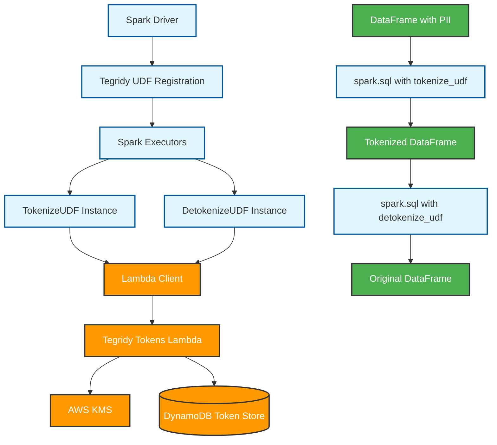

# Tegridy Tokens PySpark UDF Design Document

## Overview

This document outlines the design for implementing Tegridy Tokens as a PySpark User Defined Function (UDF) that calls the existing Lambda function to enable distributed tokenization and detokenization of sensitive data at scale within Apache Spark environments.

## Architecture

### High-Level Design



### Component Architecture

1. **UDF Registration Layer**: Registers tokenization/detokenization functions with Spark
2. **Lambda Client Layer**: Handles AWS Lambda invocations from Spark executors
3. **Batch Processing Layer**: Aggregates requests to optimize Lambda calls
4. **Error Handling Layer**: Manages Lambda timeouts, retries, and failures
5. **Caching Layer**: Optional local caching for frequently accessed tokens

## Implementation Design

### 1. PySpark UDF Structure

```python
# File: pyspark_udfs/tegridy_lambda_client.py

from pyspark.sql.functions import udf, col
from pyspark.sql.types import StringType, ArrayType, MapType
import boto3
import json
import time
from typing import Dict, List, Optional, Any
import threading
from concurrent.futures import ThreadPoolExecutor, as_completed
import logging

logger = logging.getLogger(__name__)

class TegridyLambdaClient:
    """
    PySpark UDF client for calling Tegridy Tokens Lambda function
    """
    
    def __init__(self, 
                 lambda_function_name: str,
                 aws_region: str = 'us-east-1',
                 batch_size: int = 100,  # Lambda payload limit considerations
                 max_workers: int = 5,   # Concurrent Lambda calls per executor
                 timeout: int = 300,     # Lambda timeout in seconds
                 retry_attempts: int = 3):
        self.lambda_function_name = lambda_function_name
        self.aws_region = aws_region
        self.batch_size = batch_size
        self.max_workers = max_workers
        self.timeout = timeout
        self.retry_attempts = retry_attempts
        
        # Thread-local storage for AWS clients
        self._local = threading.local()
        
        # Local cache for frequently accessed tokens
        self.token_cache = {}
        self.cache_size_limit = 1000
    
    @property
    def lambda_client(self):
        """Thread-safe Lambda client"""
        if not hasattr(self._local, 'lambda_client'):
            self._local.lambda_client = boto3.client(
                'lambda', 
                region_name=self.aws_region,
                config=boto3.session.Config(
                    retries={'max_attempts': self.retry_attempts},
                    read_timeout=self.timeout
                )
            )
        return self._local.lambda_client
    
    def tokenize_batch(self, data_batch: List[str]) -> Dict[str, str]:
        """
        Tokenize batch of sensitive data via Lambda
        Returns: Dict mapping original_data -> token
        """
        if not data_batch:
            return {}
        
        # Filter out empty/null values
        valid_data = [data for data in data_batch if data and data.strip()]
        if not valid_data:
            return {}
        
        # Check cache first
        cached_results = {}
        uncached_data = []
        
        for data in valid_data:
            if data in self.token_cache:
                cached_results[data] = self.token_cache[data]
            else:
                uncached_data.append(data)
        
        # Process uncached data through Lambda
        lambda_results = {}
        if uncached_data:
            lambda_results = self._invoke_lambda_batch('tokenize', uncached_data)
            
            # Update cache
            for data, token in lambda_results.items():
                if len(self.token_cache) < self.cache_size_limit:
                    self.token_cache[data] = token
        
        # Combine cached and Lambda results
        final_results = {**cached_results, **lambda_results}
        
        # Return results for original batch (including empty values)
        return {data: final_results.get(data) for data in data_batch}
    
    def detokenize_batch(self, token_batch: List[str]) -> Dict[str, str]:
        """
        Detokenize batch of tokens via Lambda
        Returns: Dict mapping token -> original_data
        """
        if not token_batch:
            return {}
        
        # Filter out empty/null values
        valid_tokens = [token for token in token_batch if token and token.strip()]
        if not valid_tokens:
            return {}
        
        # Detokenize via Lambda (no caching for detokenization to ensure data freshness)
        lambda_results = self._invoke_lambda_batch('detokenize', valid_tokens)
        
        # Return results for original batch
        return {token: lambda_results.get(token) for token in token_batch}
    
    def _invoke_lambda_batch(self, operation: str, data_batch: List[str]) -> Dict[str, str]:
        """
        Invoke Lambda function with batch data
        """
        results = {}
        
        # Split large batches to stay within Lambda payload limits (6MB)
        batch_chunks = [data_batch[i:i + self.batch_size] 
                       for i in range(0, len(data_batch), self.batch_size)]
        
        # Process chunks in parallel (limited by max_workers)
        with ThreadPoolExecutor(max_workers=self.max_workers) as executor:
            future_to_chunk = {
                executor.submit(self._invoke_lambda_chunk, operation, chunk): chunk 
                for chunk in batch_chunks
            }
            
            for future in as_completed(future_to_chunk):
                chunk = future_to_chunk[future]
                try:
                    chunk_results = future.result()
                    results.update(chunk_results)
                except Exception as e:
                    logger.error(f"Lambda invocation failed for chunk: {e}")
                    # Continue processing other chunks
        
        return results
    
    def _invoke_lambda_chunk(self, operation: str, data_chunk: List[str]) -> Dict[str, str]:
        """
        Invoke Lambda for a single chunk of data
        """
        # Prepare Lambda payload based on batch format
        if operation == 'tokenize':
            requests = [{"data": data} for data in data_chunk]
            payload = {"requests": requests}
        else:  # detokenize
            payload = {"tokens": data_chunk}
        
        try:
            # Invoke Lambda function
            response = self.lambda_client.invoke(
                FunctionName=self.lambda_function_name,
                InvocationType='RequestResponse',
                Payload=json.dumps(payload)
            )
            
            # Parse response
            response_payload = json.loads(response['Payload'].read())
            
            if response.get('StatusCode') != 200:
                logger.error(f"Lambda returned non-200 status: {response.get('StatusCode')}")
                return {}
            
            # Handle Lambda function errors
            if 'errorMessage' in response_payload:
                logger.error(f"Lambda function error: {response_payload['errorMessage']}")
                return {}
            
            # Parse successful response
            return self._parse_lambda_response(operation, response_payload, data_chunk)
        
        except Exception as e:
            logger.error(f"Lambda invocation failed: {e}")
            return {}
    
    def _parse_lambda_response(self, operation: str, response: dict, original_data: List[str]) -> Dict[str, str]:
        """
        Parse Lambda response into result mapping
        """
        results = {}
        
        if operation == 'tokenize':
            # Expected response format: {"responses": [{"success": true, "token": "...", "data": "..."}]}
            responses = response.get('responses', [])
            
            for i, resp in enumerate(responses):
                if i < len(original_data):
                    data = original_data[i]
                    if resp.get('success') and 'token' in resp:
                        results[data] = resp['token']
                    else:
                        logger.warning(f"Tokenization failed for data item: {resp.get('error', 'Unknown error')}")
        
        else:  # detokenize
            # Expected response format: {"tokens": {"token1": "data1", "token2": "data2"}}
            tokens_map = response.get('tokens', {})
            
            for token in original_data:
                if token in tokens_map:
                    results[token] = tokens_map[token]
                else:
                    logger.warning(f"Detokenization failed for token: {token}")
        
        return results


# Global client instance (initialized once per executor)
_lambda_client = None

def get_lambda_client(lambda_function_name: str, aws_region: str = 'us-east-1'):
    """Get or create Lambda client instance"""
    global _lambda_client
    if _lambda_client is None:
        _lambda_client = TegridyLambdaClient(lambda_function_name, aws_region)
    return _lambda_client


def tokenize_udf(lambda_function_name: str, aws_region: str = 'us-east-1'):
    """
    Create tokenize UDF that calls Lambda
    """
    def tokenize_data(data: str) -> str:
        if not data or data.strip() == '':
            return None
        
        client = get_lambda_client(lambda_function_name, aws_region)
        result = client.tokenize_batch([data])
        return result.get(data)
    
    return udf(tokenize_data, StringType())


def detokenize_udf(lambda_function_name: str, aws_region: str = 'us-east-1'):
    """
    Create detokenize UDF that calls Lambda
    """
    def detokenize_token(token: str) -> str:
        if not token or token.strip() == '':
            return None
        
        client = get_lambda_client(lambda_function_name, aws_region)
        result = client.detokenize_batch([token])
        return result.get(token)
    
    return udf(detokenize_token, StringType())


def tokenize_batch_udf(lambda_function_name: str, aws_region: str = 'us-east-1'):
    """
    Create batch tokenize UDF for array of data
    """
    def tokenize_batch_data(data_array: List[str]) -> List[str]:
        if not data_array:
            return []
        
        client = get_lambda_client(lambda_function_name, aws_region)
        token_map = client.tokenize_batch(data_array)
        return [token_map.get(data) for data in data_array]
    
    return udf(tokenize_batch_data, ArrayType(StringType()))


def detokenize_batch_udf(lambda_function_name: str, aws_region: str = 'us-east-1'):
    """
    Create batch detokenize UDF for array of tokens
    """
    def detokenize_batch_tokens(token_array: List[str]) -> List[str]:
        if not token_array:
            return []
        
        client = get_lambda_client(lambda_function_name, aws_region)
        data_map = client.detokenize_batch(token_array)
        return [data_map.get(token) for token in token_array]
    
    return udf(detokenize_batch_tokens, ArrayType(StringType()))


def tokenize_map_udf(lambda_function_name: str, aws_region: str = 'us-east-1'):
    """
    Create UDF that returns mapping of data to tokens for debugging
    """
    def tokenize_map_data(data_array: List[str]) -> Dict[str, str]:
        if not data_array:
            return {}
        
        client = get_lambda_client(lambda_function_name, aws_region)
        return client.tokenize_batch(data_array)
    
    return udf(tokenize_map_data, MapType(StringType(), StringType()))
```

### 2. Spark SQL Integration

The Tegridy Lambda UDFs can be registered and used directly in Spark SQL, providing familiar SQL syntax for data analysts and seamless integration with existing SQL-based ETL pipelines.

```python
# File: pyspark_udfs/sql_integration.py

from pyspark.sql.types import StringType, ArrayType, MapType
from pyspark_udfs.tegridy_lambda_client import (
    tokenize_udf, detokenize_udf, tokenize_batch_udf, tokenize_map_udf
)

def register_tegridy_sql_udfs(spark, lambda_function_name: str, aws_region: str = 'us-east-1'):
    """
    Register all Tegridy tokenization UDFs for use in Spark SQL
    """
    
    # Create UDF instances
    tokenize_func = tokenize_udf(lambda_function_name, aws_region)
    detokenize_func = detokenize_udf(lambda_function_name, aws_region)
    tokenize_batch_func = tokenize_batch_udf(lambda_function_name, aws_region)
    tokenize_map_func = tokenize_map_udf(lambda_function_name, aws_region)
    
    # Register UDFs for SQL usage
    spark.udf.register("tegridy_tokenize", tokenize_func.func, StringType())
    spark.udf.register("tegridy_detokenize", detokenize_func.func, StringType())
    spark.udf.register("tegridy_tokenize_batch", tokenize_batch_func.func, ArrayType(StringType()))
    spark.udf.register("tegridy_tokenize_map", tokenize_map_func.func, MapType(StringType(), StringType()))
    
    # Register conditional tokenization UDF
    def conditional_tokenize(data, should_tokenize):
        """Conditionally tokenize data based on boolean flag"""
        if should_tokenize and data and data.strip():
            from pyspark_udfs.tegridy_lambda_client import get_lambda_client
            client = get_lambda_client(lambda_function_name, aws_region)
            result = client.tokenize_batch([data])
            return result.get(data)
        return data
    
    spark.udf.register("tegridy_conditional_tokenize", conditional_tokenize, StringType())
    
    # Register format-aware tokenization UDF
    def tokenize_with_format(data, format_hint=None, preserve_format=False):
        """Tokenize with format preservation hints"""
        if not data or not data.strip():
            return None
            
        from pyspark_udfs.tegridy_lambda_client import get_lambda_client
        client = get_lambda_client(lambda_function_name, aws_region)
        
        # For now, use standard tokenization - format preservation would require Lambda updates
        result = client.tokenize_batch([data])
        return result.get(data)
    
    spark.udf.register("tegridy_tokenize_format", tokenize_with_format, StringType())


def create_tokenization_sql_functions(spark):
    """
    Create SQL helper functions for common tokenization patterns
    """
    
    # Create reusable SQL functions
    spark.sql("""
        CREATE OR REPLACE TEMPORARY FUNCTION tokenize_pii(data STRING, data_type STRING)
        RETURNS STRING
        LANGUAGE SQL
        AS $$
            CASE 
                WHEN data_type IN ('email', 'ssn', 'phone', 'credit_card') AND data IS NOT NULL
                THEN tegridy_tokenize(data)
                ELSE data
            END
        $$
    """)
    
    spark.sql("""
        CREATE OR REPLACE TEMPORARY FUNCTION safe_detokenize(token STRING, user_role STRING)
        RETURNS STRING
        LANGUAGE SQL
        AS $$
            CASE 
                WHEN user_role IN ('admin', 'analyst', 'data_scientist') AND token IS NOT NULL
                THEN tegridy_detokenize(token)
                ELSE '[REDACTED]'
            END
        $$
    """)
    
    spark.sql("""
        CREATE OR REPLACE TEMPORARY FUNCTION batch_tokenize_columns(col_array ARRAY<STRING>)
        RETURNS ARRAY<STRING>
        LANGUAGE SQL
        AS $$
            tegridy_tokenize_batch(filter(col_array, x -> x IS NOT NULL AND length(trim(x)) > 0))
        $$
    """)


# SQL usage examples
class TegridySQLExamples:
    
    @staticmethod
    def setup_example_data(spark):
        """Create example tables for demonstrations"""
        
        # Create customer data table
        spark.sql("""
            CREATE OR REPLACE TEMPORARY VIEW raw_customer_data AS
            SELECT * FROM VALUES
                (1, 'John Doe', 'john.doe@email.com', '123-45-6789', '+1-555-123-4567', 'PII'),
                (2, 'Jane Smith', 'jane.smith@email.com', '987-65-4321', '+1-555-987-6543', 'PII'),
                (3, 'Bob Johnson', 'bob.johnson@email.com', '555-44-3333', '+1-555-444-3333', 'PUBLIC'),
                (4, 'Alice Brown', 'alice.brown@email.com', '777-88-9999', '+1-555-777-8888', 'PII')
            AS customer_data(customer_id, name, email, ssn, phone, data_classification)
        """)
        
        # Create transaction data table
        spark.sql("""
            CREATE OR REPLACE TEMPORARY VIEW transaction_data AS
            SELECT * FROM VALUES
                (101, 1, '4111-1111-1111-1111', 'john.doe@email.com', 250.00, '2024-01-15'),
                (102, 2, '5555-5555-5555-4444', 'jane.smith@email.com', 175.50, '2024-01-16'),
                (103, 1, '4111-1111-1111-1111', 'john.doe@email.com', 89.99, '2024-01-17'),
                (104, 3, '3782-822463-10005', 'bob.johnson@email.com', 320.00, '2024-01-18')
            AS transactions(transaction_id, customer_id, credit_card, email, amount, transaction_date)
        """)
    
    @staticmethod
    def example_basic_tokenization(spark):
        """Basic tokenization using SQL"""
        
        result = spark.sql("""
            SELECT 
                customer_id,
                name,
                tegridy_tokenize(email) as tokenized_email,
                tegridy_tokenize(ssn) as tokenized_ssn,
                tegridy_tokenize(phone) as tokenized_phone,
                data_classification
            FROM raw_customer_data
            WHERE email IS NOT NULL
        """)
        
        return result
    
    @staticmethod  
    def example_conditional_tokenization(spark):
        """Conditional tokenization based on data classification"""
        
        result = spark.sql("""
            SELECT 
                customer_id,
                name,
                CASE 
                    WHEN data_classification = 'PII' 
                    THEN tegridy_tokenize(email)
                    ELSE email
                END as processed_email,
                tegridy_conditional_tokenize(ssn, data_classification = 'PII') as processed_ssn,
                phone
            FROM raw_customer_data
        """)
        
        return result
    
    @staticmethod
    def example_batch_processing(spark):
        """Batch tokenization using SQL aggregations"""
        
        result = spark.sql("""
            WITH customer_batches AS (
                SELECT 
                    data_classification,
                    collect_list(email) as email_batch,
                    collect_list(ssn) as ssn_batch,
                    count(*) as customer_count
                FROM raw_customer_data
                WHERE data_classification = 'PII'
                GROUP BY data_classification
            )
            SELECT 
                data_classification,
                customer_count,
                tegridy_tokenize_batch(email_batch) as tokenized_emails,
                tegridy_tokenize_batch(ssn_batch) as tokenized_ssns
            FROM customer_batches
        """)
        
        return result
    
    @staticmethod
    def example_etl_pipeline(spark):
        """Complete ETL pipeline with tokenization"""
        
        # Step 1: Tokenize sensitive customer data
        spark.sql("""
            CREATE OR REPLACE TEMPORARY VIEW tokenized_customers AS
            SELECT 
                customer_id,
                name,
                tegridy_tokenize(email) as tokenized_email,
                tegridy_tokenize(ssn) as tokenized_ssn,
                data_classification,
                current_timestamp() as tokenized_at
            FROM raw_customer_data
            WHERE data_classification = 'PII'
        """)
        
        # Step 2: Tokenize transaction data
        spark.sql("""
            CREATE OR REPLACE TEMPORARY VIEW tokenized_transactions AS
            SELECT 
                transaction_id,
                customer_id,
                tegridy_tokenize(credit_card) as tokenized_credit_card,
                tegridy_tokenize(email) as tokenized_email,
                amount,
                transaction_date
            FROM transaction_data
        """)
        
        # Step 3: Create analytics view with tokenized data
        result = spark.sql("""
            SELECT 
                tc.customer_id,
                tc.name,
                tc.tokenized_email,
                count(tt.transaction_id) as transaction_count,
                sum(tt.amount) as total_amount,
                collect_list(tt.tokenized_credit_card) as used_cards
            FROM tokenized_customers tc
            LEFT JOIN tokenized_transactions tt ON tc.customer_id = tt.customer_id
            GROUP BY tc.customer_id, tc.name, tc.tokenized_email
            ORDER BY total_amount DESC
        """)
        
        return result
    
    @staticmethod
    def example_authorized_detokenization(spark):
        """Detokenization for authorized users"""
        
        # Simulate user authorization check
        current_user = "data_scientist"  # This would come from actual auth system
        
        result = spark.sql(f"""
            SELECT 
                customer_id,
                name,
                CASE 
                    WHEN '{current_user}' IN ('admin', 'data_scientist', 'analyst')
                    THEN tegridy_detokenize(tokenized_email)
                    ELSE '[REDACTED]'
                END as email,
                safe_detokenize(tokenized_ssn, '{current_user}') as ssn
            FROM tokenized_customers
            ORDER BY customer_id
        """)
        
        return result
    
    @staticmethod
    def example_data_quality_monitoring(spark):
        """Monitor tokenization success rates using SQL"""
        
        result = spark.sql("""
            WITH tokenization_results AS (
                SELECT 
                    customer_id,
                    email,
                    tegridy_tokenize(email) as tokenized_email,
                    ssn,
                    tegridy_tokenize(ssn) as tokenized_ssn
                FROM raw_customer_data
                WHERE data_classification = 'PII'
            )
            SELECT 
                count(*) as total_records,
                sum(CASE WHEN tokenized_email IS NOT NULL THEN 1 ELSE 0 END) as successful_email_tokenization,
                sum(CASE WHEN tokenized_ssn IS NOT NULL THEN 1 ELSE 0 END) as successful_ssn_tokenization,
                round(
                    sum(CASE WHEN tokenized_email IS NOT NULL THEN 1 ELSE 0 END) * 100.0 / count(*), 2
                ) as email_success_rate,
                round(
                    sum(CASE WHEN tokenized_ssn IS NOT NULL THEN 1 ELSE 0 END) * 100.0 / count(*), 2
                ) as ssn_success_rate
            FROM tokenization_results
        """)
        
        return result
    
    @staticmethod
    def example_complex_analytics(spark):
        """Complex analytics combining tokenization with business logic"""
        
        result = spark.sql("""
            WITH monthly_customer_activity AS (
                SELECT 
                    date_trunc('month', transaction_date) as month,
                    tegridy_tokenize(email) as tokenized_customer,
                    count(*) as transaction_count,
                    sum(amount) as monthly_spend,
                    array_distinct(collect_list(tegridy_tokenize(credit_card))) as unique_cards
                FROM transaction_data
                GROUP BY date_trunc('month', transaction_date), email
            ),
            customer_segments AS (
                SELECT 
                    month,
                    tokenized_customer,
                    transaction_count,
                    monthly_spend,
                    size(unique_cards) as card_count,
                    CASE 
                        WHEN monthly_spend > 500 THEN 'HIGH_VALUE'
                        WHEN monthly_spend > 200 THEN 'MEDIUM_VALUE'
                        ELSE 'LOW_VALUE'
                    END as customer_segment
                FROM monthly_customer_activity
            )
            SELECT 
                month,
                customer_segment,
                count(*) as customer_count,
                avg(monthly_spend) as avg_spend,
                avg(transaction_count) as avg_transactions,
                avg(card_count) as avg_cards_used
            FROM customer_segments
            GROUP BY month, customer_segment
            ORDER BY month DESC, customer_segment
        """)
        
        return result
```

### 3. Complete Usage Examples

```python
# File: examples/comprehensive_usage_examples.py

from pyspark.sql import SparkSession
from pyspark.sql.functions import col, collect_list, explode, monotonically_increasing_id
from pyspark_udfs.tegridy_lambda_client import (
    tokenize_udf, detokenize_udf, 
    tokenize_batch_udf, detokenize_batch_udf,
    tokenize_map_udf
)
from pyspark_udfs.sql_integration import register_tegridy_sql_udfs, create_tokenization_sql_functions

def setup_complete_environment():
    """Setup complete Spark environment with both DataFrame and SQL UDF support"""
    
    # Initialize Spark session
    spark = SparkSession.builder \
        .appName("TegridyTokensCompleteExample") \
        .config("spark.sql.adaptive.enabled", "true") \
        .config("spark.sql.adaptive.coalescePartitions.enabled", "true") \
        .config("spark.lambda.timeout", "300") \
        .getOrCreate()

    # Configuration
    LAMBDA_FUNCTION_NAME = "tegridy-tokens-lambda"
    AWS_REGION = "us-east-1"

    # Register UDFs for both DataFrame and SQL usage
    register_tegridy_sql_udfs(spark, LAMBDA_FUNCTION_NAME, AWS_REGION)
    create_tokenization_sql_functions(spark)
    
    # Also create DataFrame UDF instances
    tokenize_func = tokenize_udf(LAMBDA_FUNCTION_NAME, AWS_REGION)
    detokenize_func = detokenize_udf(LAMBDA_FUNCTION_NAME, AWS_REGION)
    tokenize_batch_func = tokenize_batch_udf(LAMBDA_FUNCTION_NAME, AWS_REGION)
    detokenize_batch_func = detokenize_batch_udf(LAMBDA_FUNCTION_NAME, AWS_REGION)
    tokenize_map_func = tokenize_map_udf(LAMBDA_FUNCTION_NAME, AWS_REGION)
    
    return spark, {
        'tokenize': tokenize_func,
        'detokenize': detokenize_func,
        'tokenize_batch': tokenize_batch_func,
        'detokenize_batch': detokenize_batch_func,
        'tokenize_map': tokenize_map_func
    }

def example_sql_vs_dataframe_comparison():
    """Compare SQL and DataFrame approaches for the same operations"""
    
    spark, udfs = setup_complete_environment()
    
    # Create sample data
    data = [
        ("john.doe@email.com", "123-45-6789", "PII"),
        ("jane.smith@email.com", "987-65-4321", "PII"),
        ("public@email.com", "555-44-3333", "PUBLIC")
    ]
    df = spark.createDataFrame(data, ["email", "ssn", "classification"])
    df.createOrReplaceTempView("sample_data")
    
    # Approach 1: Using SQL
    sql_result = spark.sql("""
        SELECT 
            email,
            tegridy_tokenize(email) as tokenized_email_sql,
            ssn,
            tegridy_tokenize(ssn) as tokenized_ssn_sql,
            classification
        FROM sample_data
        WHERE classification = 'PII'
    """)
    
    # Approach 2: Using DataFrame API
    df_result = df.filter(col("classification") == "PII") \
                  .withColumn("tokenized_email_df", udfs['tokenize'](col("email"))) \
                  .withColumn("tokenized_ssn_df", udfs['tokenize'](col("ssn")))
    
    print("SQL Results:")
    sql_result.show()
    
    print("DataFrame Results:")
    df_result.show()
    
    return sql_result, df_result


# Additional comprehensive examples
def example_hybrid_sql_dataframe_pipeline():
    """Example showing mixing SQL and DataFrame operations"""
    
    spark, udfs = setup_complete_environment()
    
    # Create complex dataset
    data = [(i, f"user{i}@example.com", f"555-{i:04d}-{i+1000:04d}", 
             "PII" if i % 3 == 0 else "PUBLIC", f"2024-01-{(i % 28) + 1:02d}")
            for i in range(1, 1001)]
    
    df = spark.createDataFrame(data, ["user_id", "email", "phone", "classification", "signup_date"])
    df.createOrReplaceTempView("users")
    
    # Step 1: Use SQL for complex filtering and aggregation
    monthly_stats = spark.sql("""
        SELECT 
            date_trunc('month', signup_date) as month,
            classification,
            collect_list(email) as email_batch,
            collect_list(phone) as phone_batch,
            count(*) as user_count
        FROM users
        GROUP BY date_trunc('month', signup_date), classification
        HAVING classification = 'PII'
        ORDER BY month
    """)
    
    # Step 2: Use DataFrame API for batch tokenization
    tokenized_monthly = monthly_stats.withColumn(
        "tokenized_emails", udfs['tokenize_batch'](col("email_batch"))
    ).withColumn(
        "tokenized_phones", udfs['tokenize_batch'](col("phone_batch"))
    )
    
    # Step 3: Back to SQL for final analysis
    tokenized_monthly.createOrReplaceTempView("monthly_tokenized")
    
    final_result = spark.sql("""
        SELECT 
            month,
            user_count,
            size(tokenized_emails) as successfully_tokenized_emails,
            size(tokenized_phones) as successfully_tokenized_phones,
            round(size(tokenized_emails) * 100.0 / user_count, 2) as email_success_rate,
            round(size(tokenized_phones) * 100.0 / user_count, 2) as phone_success_rate
        FROM monthly_tokenized
        ORDER BY month
    """)
    
    final_result.show()
    return final_result


def example_production_etl_with_monitoring():
    """Production-ready ETL pipeline with comprehensive monitoring"""
    
    spark, udfs = setup_complete_environment()
    
    # Setup monitoring UDFs
    def track_tokenization_attempt(data, operation):
        """Track tokenization attempts for monitoring"""
        if data and data.strip():
            # In production, this would write to monitoring system
            return f"{operation}_attempted"
        return f"{operation}_skipped"
    
    spark.udf.register("track_attempt", track_tokenization_attempt, StringType())
    
    # Simulate reading from data lake
    raw_data = [(i, f"customer{i}@example.com", f"card-{i:04d}-{i+5000:04d}", 
                 f"555-{i:03d}-{i+100:04d}", "PII" if i % 2 == 0 else "PUBLIC")
                for i in range(1, 10001)]
    
    df = spark.createDataFrame(raw_data, ["customer_id", "email", "payment_method", "phone", "data_class"])
    df.createOrReplaceTempView("raw_customers")
    
    # Production ETL with monitoring
    result = spark.sql("""
        WITH tokenization_pipeline AS (
            SELECT 
                customer_id,
                email,
                tegridy_tokenize(email) as tokenized_email,
                track_attempt(email, 'email') as email_attempt_status,
                payment_method,
                tegridy_tokenize(payment_method) as tokenized_payment,
                track_attempt(payment_method, 'payment') as payment_attempt_status,
                phone,
                tegridy_tokenize(phone) as tokenized_phone,
                track_attempt(phone, 'phone') as phone_attempt_status,
                data_class,
                current_timestamp() as processed_at
            FROM raw_customers
            WHERE data_class = 'PII'
        ),
        quality_metrics AS (
            SELECT 
                *,
                CASE WHEN tokenized_email IS NOT NULL THEN 1 ELSE 0 END as email_success,
                CASE WHEN tokenized_payment IS NOT NULL THEN 1 ELSE 0 END as payment_success,
                CASE WHEN tokenized_phone IS NOT NULL THEN 1 ELSE 0 END as phone_success
            FROM tokenization_pipeline
        )
        SELECT 
            customer_id,
            tokenized_email,
            tokenized_payment, 
            tokenized_phone,
            processed_at,
            -- Quality scores
            (email_success + payment_success + phone_success) as total_successful_fields,
            CASE 
                WHEN (email_success + payment_success + phone_success) = 3 THEN 'COMPLETE'
                WHEN (email_success + payment_success + phone_success) >= 2 THEN 'PARTIAL'
                ELSE 'FAILED'
            END as tokenization_quality
        FROM quality_metrics
        ORDER BY total_successful_fields DESC, customer_id
    """)
    
    # Show quality distribution
    quality_summary = spark.sql("""
        WITH tokenized_data AS (
            -- Include the above query as a CTE
            SELECT customer_id, 
                   CASE 
                       WHEN (CASE WHEN tegridy_tokenize(email) IS NOT NULL THEN 1 ELSE 0 END +
                             CASE WHEN tegridy_tokenize(payment_method) IS NOT NULL THEN 1 ELSE 0 END +
                             CASE WHEN tegridy_tokenize(phone) IS NOT NULL THEN 1 ELSE 0 END) = 3 THEN 'COMPLETE'
                       WHEN (CASE WHEN tegridy_tokenize(email) IS NOT NULL THEN 1 ELSE 0 END +
                             CASE WHEN tegridy_tokenize(payment_method) IS NOT NULL THEN 1 ELSE 0 END +
                             CASE WHEN tegridy_tokenize(phone) IS NOT NULL THEN 1 ELSE 0 END) >= 2 THEN 'PARTIAL'
                       ELSE 'FAILED'
                   END as tokenization_quality
            FROM raw_customers
            WHERE data_class = 'PII'
        )
        SELECT 
            tokenization_quality,
            count(*) as record_count,
            round(count(*) * 100.0 / sum(count(*)) over(), 2) as percentage
        FROM tokenized_data
        GROUP BY tokenization_quality
        ORDER BY record_count DESC
    """)
    
    print("Tokenization Quality Summary:")
    quality_summary.show()
    
    return result


if __name__ == "__main__":
    # Run comprehensive examples
    print("=== SQL vs DataFrame Comparison ===")
    example_sql_vs_dataframe_comparison()
    
    print("\n=== Hybrid Pipeline Example ===")
    example_hybrid_sql_dataframe_pipeline()
    
    print("\n=== Production ETL with Monitoring ===")
    example_production_etl_with_monitoring()
```

### Key Benefits of SQL Integration

**For Data Analysts:**
- **Familiar Syntax**: Use standard SQL with tokenization capabilities
- **Complex Queries**: Leverage SQL's powerful analytical functions alongside tokenization
- **Tool Integration**: Works with SQL-based BI tools and notebooks

**For Data Engineers:**
- **Pipeline Integration**: Seamlessly integrate tokenization into existing SQL ETL pipelines
- **Performance**: Spark can optimize entire SQL queries including UDF calls
- **Flexibility**: Mix SQL and DataFrame operations as needed

**For Data Scientists:**
- **Exploratory Analysis**: Quick tokenization during data exploration
- **Feature Engineering**: Tokenize features as part of ML pipelines
- **A/B Testing**: Compare tokenized vs non-tokenized analytical results

### 4. Additional DataFrame Examples

```python
# Example: Optimized batch processing for large datasets
def example_batch_processing():
    # Large dataset simulation
    large_data = [(f"user{i}@example.com", f"555-{i:04d}-{i+1000:04d}") 
                  for i in range(10000)]
    
    df = spark.createDataFrame(large_data, ["email", "phone"])
    
    # Approach 1: Individual UDF calls (simpler but more Lambda invocations)
    simple_tokenized_df = df.withColumn("tokenized_email", tokenize_func(col("email"))) \
                           .withColumn("tokenized_phone", tokenize_func(col("phone")))
    
    # Approach 2: Batch processing within partitions (more efficient)
    # Group data into partitions and process as batches
    batch_df = df.repartition(10)  # Control partition count for optimal Lambda batch sizes
    
    # Use window functions to collect data within partitions
    from pyspark.sql.window import Window
    from pyspark.sql.functions import collect_list, row_number, size
    
    # Create row numbers within partitions
    window = Window.partitionBy().orderBy(monotonically_increasing_id())
    df_with_row = batch_df.withColumn("row_num", row_number().over(window))
    
    # Group into batches of 100 for optimal Lambda performance
    batch_size = 100
    df_batched = df_with_row.withColumn("batch_id", (col("row_num") - 1) / batch_size)
    
    # Collect into arrays by batch
    batched_data = df_batched.groupBy("batch_id").agg(
        collect_list("email").alias("email_batch"),
        collect_list("phone").alias("phone_batch")
    )
    
    # Tokenize batches via Lambda
    tokenized_batches = batched_data.withColumn(
        "tokenized_emails", tokenize_batch_func(col("email_batch"))
    ).withColumn(
        "tokenized_phones", tokenize_batch_func(col("phone_batch"))
    )
    
    # Explode back to individual rows with proper ordering
    from pyspark.sql.functions import posexplode, arrays_zip
    
    exploded_df = tokenized_batches.select(
        "batch_id",
        posexplode(arrays_zip("email_batch", "tokenized_emails", "phone_batch", "tokenized_phones")).alias("pos", "data")
    ).select(
        "batch_id",
        "pos",
        col("data.email_batch").alias("email"),
        col("data.tokenized_emails").alias("tokenized_email"),
        col("data.phone_batch").alias("phone"),
        col("data.tokenized_phones").alias("tokenized_phone")
    )
    
    exploded_df.show(20)


# Example 3: ETL Pipeline with Lambda-based tokenization
def example_etl_pipeline():
    # Read from source (e.g., Parquet, Delta, etc.)
    source_df = spark.read.parquet("s3://data-lake/customer-data/")
    
    # Define sensitive columns
    sensitive_columns = ["email", "ssn", "credit_card", "phone"]
    
    # Approach 1: Individual column tokenization (simpler)
    tokenized_df = source_df
    for col_name in sensitive_columns:
        if col_name in source_df.columns:
            tokenized_df = tokenized_df.withColumn(
                f"tokenized_{col_name}", 
                tokenize_func(col(col_name))
            ).drop(col_name)
    
    # Write tokenized data to analytics storage
    tokenized_df.write.mode("overwrite").parquet("s3://analytics-lake/tokenized-data/")
    
    # For reporting that needs original data (with proper authorization)
    if check_user_authorization():  # Implement authorization logic
        reporting_df = tokenized_df
        for col_name in sensitive_columns:
            tokenized_col = f"tokenized_{col_name}"
            if tokenized_col in tokenized_df.columns:
                reporting_df = reporting_df.withColumn(
                    col_name,
                    detokenize_func(col(tokenized_col))
                )
        
        reporting_df.write.mode("overwrite").parquet("s3://reporting-lake/full-data/")


# Example 4: Lambda cost optimization with smart batching
def example_cost_optimized_processing():
    # Read large dataset
    df = spark.read.parquet("s3://big-data-lake/customer-transactions/")
    
    # Count records per partition to optimize Lambda calls
    partition_counts = df.groupBy(spark_partition_id()).count()
    partition_counts.show()
    
    # Repartition to optimal size (aim for 500-1000 records per partition)
    optimal_partitions = max(1, df.count() // 750)  # Target ~750 records per partition
    df_optimized = df.repartition(optimal_partitions)
    
    # Process using mapPartitions for maximum efficiency
    def tokenize_partition(iterator):
        # Collect all data in partition
        partition_data = list(iterator)
        if not partition_data:
            return []
        
        # Extract sensitive data
        emails = [row.email for row in partition_data if row.email]
        
        # Single Lambda call for entire partition
        client = get_lambda_client(LAMBDA_FUNCTION_NAME, AWS_REGION)
        token_map = client.tokenize_batch(emails)
        
        # Return tokenized rows
        result = []
        for row in partition_data:
            row_dict = row.asDict()
            row_dict['tokenized_email'] = token_map.get(row.email)
            result.append(Row(**row_dict))
        
        return result
    
    # Apply partition-wise processing
    from pyspark.sql import Row
    tokenized_rdd = df_optimized.rdd.mapPartitions(tokenize_partition)
    
    # Convert back to DataFrame
    tokenized_df = spark.createDataFrame(tokenized_rdd)
    tokenized_df.show()


# Example 5: Error handling and monitoring
def example_error_handling():
    # Sample data with some invalid entries
    data = [
        ("valid@email.com",),
        (None,),  # Null value
        ("",),    # Empty string
        ("another@email.com",),
        ("invalid-email",)  # Might fail tokenization
    ]
    
    df = spark.createDataFrame(data, ["email"])
    
    # Tokenize with error handling
    tokenized_df = df.withColumn(
        "tokenized_email", 
        when(col("email").isNotNull() & (col("email") != ""), 
             tokenize_func(col("email")))
        .otherwise(None)
    )
    
    # Add success/failure tracking
    tokenized_df = tokenized_df.withColumn(
        "tokenization_success",
        when(col("tokenized_email").isNotNull(), True).otherwise(False)
    )
    
    # Monitor tokenization success rate
    success_rate = tokenized_df.agg(
        (sum(col("tokenization_success").cast("int")) / count("*")).alias("success_rate")
    ).collect()[0]["success_rate"]
    
    print(f"Tokenization success rate: {success_rate:.2%}")
    
    tokenized_df.show()


def check_user_authorization():
    """Placeholder for authorization logic"""
    return True  # Implement proper authorization


if __name__ == "__main__":
    example_single_column_tokenization()
    # example_batch_processing()
    # example_etl_pipeline()
    
    spark.stop()
```

### 3. Performance Optimizations

```python
# File: pyspark_udfs/lambda_optimizations.py

import time
from typing import Dict, List
from concurrent.futures import ThreadPoolExecutor
import logging

logger = logging.getLogger(__name__)

class OptimizedLambdaClient(TegridyLambdaClient):
    """
    Performance-optimized Lambda client with advanced caching and batching
    """
    
    def __init__(self, *args, **kwargs):
        super().__init__(*args, **kwargs)
        self.request_cache = {}  # Cache Lambda requests to avoid duplicates
        self.cache_ttl = kwargs.get('cache_ttl', 300)  # 5 minutes TTL
        self.adaptive_batching = kwargs.get('adaptive_batching', True)
        self.metrics = {
            'cache_hits': 0,
            'cache_misses': 0,
            'lambda_calls': 0,
            'total_requests': 0
        }
    
    def tokenize_batch_optimized(self, data_batch: List[str]) -> Dict[str, str]:
        """
        Optimized batch tokenization with deduplication and intelligent caching
        """
        if not data_batch:
            return {}
        
        self.metrics['total_requests'] += len(data_batch)
        
        # Remove duplicates while preserving order
        seen = set()
        unique_data = []
        for item in data_batch:
            if item not in seen and item and item.strip():
                seen.add(item)
                unique_data.append(item)
        
        # Check cache with TTL
        current_time = time.time()
        cached_results = {}
        uncached_data = []
        
        for data in unique_data:
            cache_key = f"token:{hash(data)}"
            if cache_key in self.request_cache:
                cached_entry = self.request_cache[cache_key]
                if current_time - cached_entry['timestamp'] < self.cache_ttl:
                    cached_results[data] = cached_entry['token']
                    self.metrics['cache_hits'] += 1
                else:
                    # Cache expired
                    del self.request_cache[cache_key]
                    uncached_data.append(data)
                    self.metrics['cache_misses'] += 1
            else:
                uncached_data.append(data)
                self.metrics['cache_misses'] += 1
        
        # Process uncached data with adaptive batching
        lambda_results = {}
        if uncached_data:
            lambda_results = self._adaptive_lambda_processing(uncached_data)
            
            # Update cache
            for data, token in lambda_results.items():
                cache_key = f"token:{hash(data)}"
                self.request_cache[cache_key] = {
                    'token': token,
                    'timestamp': current_time
                }
                
                # Implement cache size limit with LRU eviction
                if len(self.request_cache) > self.cache_size_limit:
                    self._evict_oldest_cache_entry()
        
        # Combine results
        final_results = {**cached_results, **lambda_results}
        
        # Return results for original batch (including duplicates)
        return {data: final_results.get(data) for data in data_batch}
    
    def _adaptive_lambda_processing(self, data_batch: List[str]) -> Dict[str, str]:
        """
        Adaptively adjust batch size based on Lambda performance
        """
        if not self.adaptive_batching:
            return self._invoke_lambda_batch('tokenize', data_batch)
        
        # Start with configured batch size
        current_batch_size = self.batch_size
        results = {}
        
        # Process in adaptive batches
        for i in range(0, len(data_batch), current_batch_size):
            batch = data_batch[i:i + current_batch_size]
            
            start_time = time.time()
            try:
                batch_results = self._invoke_lambda_batch('tokenize', batch)
                processing_time = time.time() - start_time
                
                # Adjust batch size based on performance
                if processing_time < 1.0 and current_batch_size < 200:
                    current_batch_size = min(200, int(current_batch_size * 1.2))
                elif processing_time > 5.0 and current_batch_size > 10:
                    current_batch_size = max(10, int(current_batch_size * 0.8))
                
                results.update(batch_results)
                self.metrics['lambda_calls'] += 1
                
            except Exception as e:
                logger.error(f"Adaptive batch processing failed: {e}")
                # Fallback to smaller batch size
                current_batch_size = max(5, current_batch_size // 2)
        
        return results
    
    def _evict_oldest_cache_entry(self):
        """Evict the oldest cache entry (LRU)"""
        if self.request_cache:
            oldest_key = min(self.request_cache.keys(), 
                           key=lambda k: self.request_cache[k]['timestamp'])
            del self.request_cache[oldest_key]
    
    def get_metrics(self) -> Dict:
        """Get performance metrics"""
        total_requests = self.metrics['total_requests']
        if total_requests > 0:
            self.metrics['cache_hit_rate'] = self.metrics['cache_hits'] / total_requests
        return self.metrics.copy()


# Partition-aware processing for optimal Lambda utilization
def optimize_spark_partitioning(df, target_records_per_partition=500):
    """
    Optimize DataFrame partitioning for Lambda-based tokenization
    """
    total_records = df.count()
    optimal_partitions = max(1, total_records // target_records_per_partition)
    
    # Ensure we don't create too many small partitions
    min_partitions = 2
    max_partitions = 100
    optimal_partitions = max(min_partitions, min(max_partitions, optimal_partitions))
    
    return df.repartition(optimal_partitions)


# Smart caching strategy
class SparkLambdaCacheManager:
    """
    Manages caching strategy across Spark executors
    """
    
    def __init__(self, spark_context):
        self.spark_context = spark_context
        self.cache_config = {
            'enable_broadcast_cache': True,
            'cache_frequent_tokens': True,
            'cache_size_per_executor': 1000
        }
    
    def setup_broadcast_cache(self, frequent_data: List[str], lambda_function_name: str):
        """
        Pre-tokenize frequently accessed data and broadcast to all executors
        """
        if not self.cache_config['enable_broadcast_cache']:
            return None
        
        # Tokenize frequent data once
        client = TegridyLambdaClient(lambda_function_name)
        token_map = client.tokenize_batch(frequent_data)
        
        # Broadcast to all executors
        return self.spark_context.broadcast(token_map)


# Cost optimization utilities
def estimate_lambda_costs(df, sensitive_columns: List[str], lambda_price_per_request=0.0000002):
    """
    Estimate Lambda costs for tokenization operations
    """
    total_records = df.count()
    total_sensitive_fields = len(sensitive_columns) * total_records
    
    # Estimate Lambda invocations (assuming batch processing)
    avg_batch_size = 100
    estimated_lambda_calls = (total_sensitive_fields + avg_batch_size - 1) // avg_batch_size
    
    estimated_cost = estimated_lambda_calls * lambda_price_per_request
    
    return {
        'total_records': total_records,
        'total_sensitive_fields': total_sensitive_fields,
        'estimated_lambda_calls': estimated_lambda_calls,
        'estimated_cost_usd': estimated_cost,
        'cost_per_record': estimated_cost / total_records if total_records > 0 else 0
    }


# Monitoring and alerting
def setup_lambda_monitoring(spark):
    """
    Setup monitoring for Lambda UDF performance
    """
    # Add custom metrics accumulator
    lambda_metrics = spark.sparkContext.accumulator(0, "LambdaCallsAccumulator")
    failed_requests = spark.sparkContext.accumulator(0, "FailedRequestsAccumulator")
    
    return {
        'lambda_calls': lambda_metrics,
        'failed_requests': failed_requests
    }
```

### 4. Deployment and Configuration

```yaml
# File: deployment/spark-submit-config.yaml
# Spark submit configuration for Tegridy Tokens Lambda UDF

spark-submit-args:
  --name: "TegridyTokensLambdaPipeline"
  --master: "yarn"
  --deploy-mode: "cluster"
  --num-executors: 20
  --executor-cores: 4
  --executor-memory: "8g"
  --driver-memory: "4g"
  --conf:
    - "spark.sql.adaptive.enabled=true"
    - "spark.sql.adaptive.coalescePartitions.enabled=true"
    - "spark.sql.adaptive.skewJoin.enabled=true"
    - "spark.sql.execution.arrow.pyspark.enabled=true"
    - "spark.dynamicAllocation.enabled=true"
    - "spark.dynamicAllocation.minExecutors=5"
    - "spark.dynamicAllocation.maxExecutors=50"
    - "spark.lambda.timeout=300"
    - "spark.lambda.retry.attempts=3"
  --packages:
    - "org.apache.hadoop:hadoop-aws:3.3.1"
    - "com.amazonaws:aws-java-sdk-bundle:1.11.901"
  --py-files: "tegridy_lambda_udfs.zip"

# Environment variables
environment:
  AWS_DEFAULT_REGION: "us-east-1"
  TEGRIDY_LAMBDA_FUNCTION_NAME: "tegridy-tokens-lambda"
  PYTHONPATH: "/opt/spark/python:/opt/spark/python/lib/py4j-*.zip"
```

```python
# File: deployment/lambda_cluster_setup.py
# Setup script for Spark cluster with Lambda integration

def setup_tegridy_lambda_environment():
    """
    Setup Tegridy Tokens Lambda UDF environment on Spark cluster
    """
    # Install required Python packages
    pip_packages = [
        "boto3>=1.26.0",
        "pyspark>=3.3.0"
    ]
    
    # Create zip file with Lambda UDF code
    import zipfile
    with zipfile.ZipFile('tegridy_lambda_udfs.zip', 'w') as zipf:
        zipf.write('pyspark_udfs/tegridy_lambda_client.py', 'tegridy_lambda_client.py')
        zipf.write('pyspark_udfs/lambda_optimizations.py', 'lambda_optimizations.py')
    
    # AWS IAM role setup for Spark executors (Lambda access focused)
    iam_policy = {
        "Version": "2012-10-17",
        "Statement": [
            {
                "Effect": "Allow",
                "Action": [
                    "lambda:InvokeFunction"
                ],
                "Resource": "arn:aws:lambda:*:*:function:tegridy-tokens-*"
            },
            {
                "Effect": "Allow",
                "Action": [
                    "logs:CreateLogGroup",
                    "logs:CreateLogStream",
                    "logs:PutLogEvents"
                ],
                "Resource": "arn:aws:logs:*:*:*"
            }
        ]
    }
    
    return iam_policy

def setup_lambda_function_permissions():
    """
    Setup Lambda function permissions for Spark cluster access
    """
    # Resource-based policy for Lambda function
    lambda_policy = {
        "Version": "2012-10-17",
        "Statement": [
            {
                "Effect": "Allow",
                "Principal": {
                    "AWS": "arn:aws:iam::ACCOUNT-ID:role/spark-executor-role"
                },
                "Action": "lambda:InvokeFunction",
                "Resource": "arn:aws:lambda:REGION:ACCOUNT-ID:function:tegridy-tokens-lambda"
            }
        ]
    }
    
    return lambda_policy

# Spark configuration optimized for Lambda calls
def get_optimized_spark_config():
    """
    Get Spark configuration optimized for Lambda-based tokenization
    """
    config = {
        # Enable adaptive query execution
        "spark.sql.adaptive.enabled": "true",
        "spark.sql.adaptive.coalescePartitions.enabled": "true",
        "spark.sql.adaptive.advisoryPartitionSizeInBytes": "128MB",
        
        # Optimize for Lambda payload sizes
        "spark.sql.execution.arrow.maxRecordsPerBatch": "1000",
        
        # Network and timeout settings for Lambda calls
        "spark.network.timeout": "600s",
        "spark.sql.broadcastTimeout": "600",
        
        # Memory management for large Lambda responses
        "spark.sql.execution.arrow.pyspark.enabled": "true",
        "spark.serializer": "org.apache.spark.serializer.KryoSerializer",
        
        # Dynamic allocation for variable Lambda workloads
        "spark.dynamicAllocation.enabled": "true",
        "spark.dynamicAllocation.minExecutors": "2",
        "spark.dynamicAllocation.maxExecutors": "100",
        "spark.dynamicAllocation.initialExecutors": "10",
        
        # Lambda-specific configurations
        "spark.lambda.batch.size": "100",
        "spark.lambda.timeout": "300",
        "spark.lambda.retry.attempts": "3",
        "spark.lambda.concurrent.requests": "5"
    }
    
    return config
```

## Performance Considerations

### 1. Lambda Optimization Strategy
- **Batch Size Optimization**: Target 100-500 items per Lambda call for optimal performance
- **Concurrent Invocations**: Limit concurrent Lambda calls per executor (5-10) to avoid throttling
- **Payload Size Management**: Stay within 6MB Lambda payload limits
- **Cold Start Mitigation**: Use provisioned concurrency for predictable performance

### 2. Spark-Lambda Integration
- **Partition Sizing**: Optimize partitions for 500-1000 records per partition
- **Connection Pooling**: Reuse Lambda clients across UDF calls within executors
- **Error Handling**: Implement exponential backoff for Lambda throttling
- **Cost Management**: Monitor Lambda invocation costs and optimize batch sizes

### 3. Caching Strategy
- **Executor-level Caching**: Cache frequently tokenized data within each executor
- **TTL Management**: Implement reasonable cache TTL (5-15 minutes) for data freshness
- **Memory Management**: Limit cache size to prevent executor memory issues
- **Deduplication**: Remove duplicate data before Lambda calls to reduce costs

### 4. Scaling Considerations
- **Lambda Concurrency**: Configure reserved concurrency for the tokenization Lambda
- **Spark Dynamic Allocation**: Use dynamic allocation to scale with Lambda capacity
- **Throttling Handling**: Implement retry logic with exponential backoff
- **Resource Management**: Balance executor memory between Spark processing and Lambda client overhead

## Security Considerations

### 1. Lambda Function Security
- **Function Isolation**: Lambda provides secure execution environment with no persistent storage
- **Network Security**: Deploy Lambda in VPC for additional network isolation
- **Environment Variables**: Secure storage of configuration through AWS Systems Manager Parameter Store
- **Function Permissions**: Minimal IAM permissions for Lambda execution role

### 2. Spark-Lambda Communication
- **IAM Roles**: Least-privilege IAM roles for Spark executors to invoke Lambda
- **TLS Encryption**: All Lambda invocations use TLS 1.2+ encryption in transit
- **VPC Endpoints**: Use VPC endpoints for Lambda invocations to avoid internet routing
- **Network ACLs**: Configure network access controls for Spark cluster communication

### 3. Data Protection
- **Payload Encryption**: Sensitive data encrypted by Lambda using KMS before storage
- **Memory Protection**: No persistent storage of sensitive data in Spark executors
- **Lambda Logs**: Ensure no sensitive data is logged by Lambda function
- **Spark History**: Sanitize Spark execution logs to prevent sensitive data exposure

### 4. Access Control and Compliance
- **Resource-based Policies**: Restrict Lambda function access to specific Spark execution roles
- **CloudTrail Integration**: Log all Lambda invocations and tokenization operations
- **Data Lineage**: Track tokenization operations through Spark and Lambda logs
- **Compliance Monitoring**: Monitor for unauthorized access attempts and unusual patterns

## Testing Strategy

### 1. Unit Tests
```python
# File: tests/test_tegridy_lambda_udfs.py

import pytest
import boto3
from moto import mock_lambda
from pyspark.sql import SparkSession
from pyspark_udfs.tegridy_lambda_client import TegridyLambdaClient

class TestTegridyLambdaUDFs:
    
    @pytest.fixture
    def spark(self):
        return SparkSession.builder.appName("test").getOrCreate()
    
    @mock_lambda
    @pytest.fixture
    def mock_lambda_client(self):
        # Create mock Lambda function for testing
        lambda_client = boto3.client('lambda', region_name='us-east-1')
        
        # Create a mock Lambda function
        lambda_client.create_function(
            FunctionName='test-tegridy-tokens',
            Runtime='provided.al2023',
            Role='arn:aws:iam::123456789:role/test-role',
            Handler='bootstrap',
            Code={'ZipFile': b'fake code'},
            Architecture='arm64'
        )
        
        return lambda_client
    
    def test_lambda_client_initialization(self):
        client = TegridyLambdaClient("test-function", "us-east-1")
        assert client.lambda_function_name == "test-function"
        assert client.aws_region == "us-east-1"
    
    def test_batch_processing_empty_input(self):
        client = TegridyLambdaClient("test-function", "us-east-1")
        result = client.tokenize_batch([])
        assert result == {}
    
    def test_payload_construction(self):
        client = TegridyLambdaClient("test-function", "us-east-1")
        
        # Test tokenize payload
        data_chunk = ["test1@example.com", "test2@example.com"]
        # Mock the _invoke_lambda_chunk method for testing
        # This would test payload structure without actual Lambda calls
        pass
    
    def test_udf_registration(self, spark):
        from pyspark_udfs.tegridy_lambda_client import tokenize_udf
        
        # Test UDF registration
        tokenize_func = tokenize_udf("test-function", "us-east-1")
        assert tokenize_func is not None
    
    def test_error_handling(self):
        client = TegridyLambdaClient("non-existent-function", "us-east-1")
        
        # Test handling of Lambda function not found
        result = client.tokenize_batch(["test@example.com"])
        # Should handle errors gracefully and return empty results
        assert isinstance(result, dict)
```

### 2. Integration Tests
```python
# File: tests/test_lambda_integration.py

import pytest
import boto3
from pyspark.sql import SparkSession
from pyspark.sql.types import StringType
from pyspark_udfs.tegridy_lambda_client import tokenize_udf, detokenize_udf

class TestLambdaIntegration:
    
    @pytest.fixture
    def spark(self):
        return SparkSession.builder.appName("integration-test").getOrCreate()
    
    @pytest.fixture
    def lambda_function_name(self):
        # Use actual deployed Lambda function for integration tests
        return "tegridy-tokens-lambda-test"
    
    def test_real_lambda_invocation(self, spark, lambda_function_name):
        # Test with real Lambda function (requires deployed infrastructure)
        tokenize_func = tokenize_udf(lambda_function_name, "us-east-1")
        
        # Create test DataFrame
        data = [("test@example.com",), ("user@test.com",)]
        df = spark.createDataFrame(data, ["email"])
        
        # Apply tokenization
        result_df = df.withColumn("token", tokenize_func(df.email))
        
        # Collect results
        results = result_df.collect()
        
        # Verify tokens were generated
        for row in results:
            assert row.token is not None
            assert len(row.token) > 0
    
    def test_lambda_performance(self, spark, lambda_function_name):
        # Test Lambda performance with larger dataset
        import time
        
        # Generate test data
        data = [(f"user{i}@example.com",) for i in range(1000)]
        df = spark.createDataFrame(data, ["email"])
        
        tokenize_func = tokenize_udf(lambda_function_name, "us-east-1")
        
        start_time = time.time()
        result_df = df.withColumn("token", tokenize_func(df.email))
        result_count = result_df.count()
        end_time = time.time()
        
        assert result_count == 1000
        processing_time = end_time - start_time
        
        # Performance assertion (adjust based on expected performance)
        assert processing_time < 60  # Should complete within 60 seconds
    
    def test_lambda_error_scenarios(self, spark):
        # Test error handling with invalid Lambda function
        tokenize_func = tokenize_udf("non-existent-function", "us-east-1")
        
        data = [("test@example.com",)]
        df = spark.createDataFrame(data, ["email"])
        
        # Should handle errors gracefully
        result_df = df.withColumn("token", tokenize_func(df.email))
        results = result_df.collect()
        
        # Should return null for failed tokenizations
        assert results[0].token is None
```

### 3. Performance Tests
```python
# File: tests/test_performance.py

import pytest
import time
from pyspark.sql import SparkSession
from pyspark_udfs.tegridy_lambda_client import tokenize_batch_udf

class TestPerformance:
    
    @pytest.fixture
    def spark(self):
        return SparkSession.builder \
            .appName("performance-test") \
            .config("spark.sql.adaptive.enabled", "true") \
            .getOrCreate()
    
    def test_batch_vs_individual_performance(self, spark):
        # Compare batch vs individual tokenization performance
        lambda_function_name = "tegridy-tokens-lambda-test"
        
        # Test data
        data = [(f"user{i}@example.com",) for i in range(5000)]
        df = spark.createDataFrame(data, ["email"])
        
        # Individual tokenization
        from pyspark_udfs.tegridy_lambda_client import tokenize_udf
        tokenize_func = tokenize_udf(lambda_function_name, "us-east-1")
        
        start_time = time.time()
        individual_df = df.withColumn("token", tokenize_func(df.email))
        individual_count = individual_df.count()
        individual_time = time.time() - start_time
        
        # Batch tokenization
        from pyspark.sql.functions import collect_list
        tokenize_batch_func = tokenize_batch_udf(lambda_function_name, "us-east-1")
        
        start_time = time.time()
        batch_df = df.groupBy().agg(collect_list("email").alias("emails")) \
                   .withColumn("tokens", tokenize_batch_func(df.emails))
        batch_count = batch_df.count()
        batch_time = time.time() - start_time
        
        # Batch should be significantly faster
        print(f"Individual time: {individual_time}s")
        print(f"Batch time: {batch_time}s")
        
        assert batch_time < individual_time * 0.5  # Batch should be at least 2x faster
    
    def test_scaling_performance(self, spark):
        # Test performance scaling with different data sizes
        lambda_function_name = "tegridy-tokens-lambda-test"
        tokenize_func = tokenize_udf(lambda_function_name, "us-east-1")
        
        sizes = [100, 500, 1000, 5000]
        times = []
        
        for size in sizes:
            data = [(f"user{i}@example.com",) for i in range(size)]
            df = spark.createDataFrame(data, ["email"])
            
            start_time = time.time()
            result_df = df.withColumn("token", tokenize_func(df.email))
            result_count = result_df.count()
            end_time = time.time()
            
            processing_time = end_time - start_time
            times.append(processing_time)
            
            assert result_count == size
            
            # Log performance metrics
            print(f"Size: {size}, Time: {processing_time:.2f}s, Rate: {size/processing_time:.2f} records/sec")
        
        # Verify that processing time scales reasonably
        # (not perfectly linear due to Lambda cold starts and other factors)
        assert times[-1] / times[0] < (sizes[-1] / sizes[0]) * 2
```

### 4. End-to-End Tests
- **Pipeline Testing**: Full ETL pipeline with Lambda-based tokenization
- **Data Validation**: Ensure data integrity throughout the Spark-Lambda process
- **Scalability Testing**: Test with production-sized datasets and concurrent workloads
- **Cost Validation**: Monitor Lambda costs and ensure they stay within expected ranges

## Deployment Recommendations

### 1. Infrastructure Setup
- **EMR/Databricks**: Use managed Spark services with Lambda access
- **Lambda Configuration**: Deploy with provisioned concurrency for consistent performance
- **VPC Setup**: Configure VPC endpoints for secure Lambda communication
- **IAM Roles**: Implement least-privilege access between Spark and Lambda

### 2. Lambda Function Optimization
- **Provisioned Concurrency**: Configure based on expected Spark workload
- **Memory Allocation**: Optimize Lambda memory for tokenization throughput
- **Timeout Configuration**: Set appropriate timeouts (300s recommended)
- **Dead Letter Queues**: Configure for failed Lambda invocations

### 3. Spark Cluster Configuration
- **Dynamic Allocation**: Enable auto-scaling based on Lambda capacity
- **Executor Sizing**: Balance memory for Lambda client overhead
- **Network Configuration**: Optimize for Lambda API calls
- **Monitoring**: Implement CloudWatch metrics for Lambda invocations

### 4. Cost Optimization
- **Lambda Pricing**: Monitor per-invocation costs and optimize batch sizes
- **Spot Instances**: Use for Spark workers where appropriate
- **Reserved Capacity**: Consider reserved Lambda capacity for predictable workloads
- **Right-sizing**: Optimize Spark cluster size for Lambda call patterns

## Migration Strategy

### 1. From Direct Database Access to Lambda-based UDF
1. **Incremental Adoption**: Start with new Spark workloads using Lambda UDF
2. **Performance Comparison**: Benchmark Lambda UDF vs direct database access
3. **Gradual Migration**: Migrate existing Spark jobs incrementally
4. **Validation**: Ensure consistent tokenization results across approaches

### 2. Lambda Function Compatibility
1. **API Consistency**: Ensure Lambda function maintains batch API format
2. **Version Management**: Use Lambda aliases for gradual rollout
3. **Backward Compatibility**: Maintain support for existing token formats
4. **Rollback Plan**: Quick rollback to previous Lambda versions if needed

### 3. Monitoring and Validation
1. **Performance Metrics**: Compare throughput and latency
2. **Cost Analysis**: Monitor Lambda vs infrastructure costs
3. **Data Integrity**: Validate tokenization consistency
4. **Error Rates**: Track and compare error rates between approaches

## Summary

This design provides a comprehensive approach to implementing Tegridy Tokens as PySpark UDFs that leverage the existing Lambda function infrastructure. Key benefits include:

**Architecture Benefits:**
- **Separation of Concerns**: Spark handles data processing, Lambda handles tokenization
- **Centralized Logic**: All tokenization logic remains in the Lambda function
- **Scalability**: Both Spark and Lambda can scale independently
- **Consistency**: Same tokenization logic across all access patterns

**Performance Optimizations:**
- **Intelligent Batching**: Automatically optimize batch sizes for Lambda performance
- **Caching**: Executor-level caching reduces redundant Lambda calls
- **Concurrent Processing**: Multiple Lambda invocations per Spark partition
- **Adaptive Scaling**: Dynamic adjustment based on Lambda response times

**Security and Compliance:**
- **Minimal Attack Surface**: No sensitive data persistence in Spark executors
- **Centralized Security**: All encryption/decryption handled by Lambda
- **Audit Trail**: Complete tracking through CloudTrail and Spark logs
- **Access Control**: IAM-based access control for Lambda invocations

**Operational Benefits:**
- **Simplified Deployment**: Leverage existing Lambda infrastructure
- **Cost Optimization**: Pay-per-use Lambda model vs persistent infrastructure
- **Monitoring**: Comprehensive monitoring through CloudWatch and Spark UI
- **Error Handling**: Robust retry logic and graceful degradation

This Lambda-based approach provides the flexibility of distributed processing while maintaining the security and consistency of centralized tokenization services.