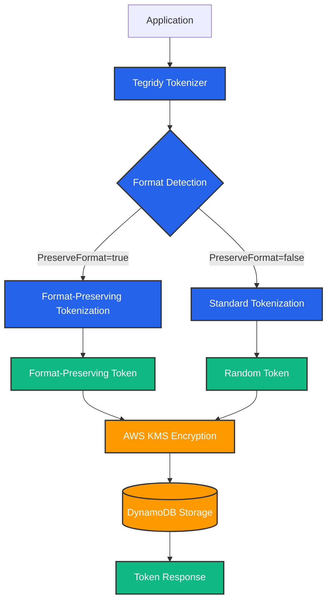

# Tegridy Tokens

A high-performance Go library for tokenizing and detokenizing sensitive data using AWS DynamoDB and KMS, optimized for big data workflows.

## Features

- **Secure Tokenization**: Replace sensitive data with non-sensitive tokens
- **Format-Preserving Tokenization (FPT)**: Generate tokens that maintain the format of original data
- **Envelope Encryption**: Uses AWS KMS for key management with local data encryption for performance
- **Batch Processing**: Optimized for processing large volumes of data
- **Concurrent Processing**: Parallel processing with configurable worker pools
- **Big Data Ready**: Designed to handle millions of tokens efficiently

## Architecture

Based on AWS best practices for tokenization:



## Installation

```bash
go get github.com/allen13/tegridy-tokens
```

## Usage

### Basic Usage

```go
import (
    "github.com/allen13/tegridy-tokens/pkg/tokenizer"
    "github.com/allen13/tegridy-tokens/pkg/repository"
    "github.com/allen13/tegridy-tokens/pkg/encryption"
)

// Create repository
repo := repository.NewDynamoDBRepository(repository.DynamoDBConfig{
    Client:    dynamoClient,
    TableName: "tegridy-tokens",
})

// Create encryptor
enc := encryption.NewKMSEncryptor(encryption.KMSConfig{
    Client:      kmsClient,
    KeyID:       "alias/tegridy-tokens",
    UseEnvelope: true,
})

// Create tokenizer
tkn := tokenizer.NewTokenizer(tokenizer.Config{
    Repository: repo,
    Encryptor:  enc,
})

// Tokenize data
resp, err := tkn.Tokenize(ctx, tokenizer.TokenRequest{
    Data: "4111-1111-1111-1111",
})

// Detokenize
data, err := tkn.Detokenize(ctx, resp.Token)
```

### Format-Preserving Tokenization

Generate tokens that maintain the original data format for better usability:

```go
// Configure tokenizer with FPT enabled
tkn := tokenizer.NewTokenizer(tokenizer.Config{
    Repository: repo,
    Encryptor:  enc,
    EnableFPT:  true,
    FPTConfig: tokenizer.FPTGeneratorConfig{
        AutoDetect:    true,
        DefaultFormat: tokenizer.FormatNone,
    },
})

// Credit card tokenization with format preservation
resp, err := tkn.Tokenize(ctx, tokenizer.TokenRequest{
    Data:           "4111-1111-1111-1111",
    PreserveFormat: true,
})
// Result: Token = "7561-6533-6533-6533" (maintains XXXX-XXXX-XXXX-XXXX format)

// SSN tokenization with format preservation
resp, err := tkn.Tokenize(ctx, tokenizer.TokenRequest{
    Data:           "123-45-6789",
    PreserveFormat: true,
})
// Result: Token = "697-69-5848" (maintains XXX-XX-XXXX format)

// Phone number tokenization with format preservation
resp, err := tkn.Tokenize(ctx, tokenizer.TokenRequest{
    Data:           "+1-555-123-4567",
    PreserveFormat: true,
})
// Result: Token = "+1-857-697-6800" (maintains +1-XXX-XXX-XXXX format)

// Numeric data tokenization with format preservation
resp, err := tkn.Tokenize(ctx, tokenizer.TokenRequest{
    Data:           "1234567890",
    PreserveFormat: true,
})
// Result: Token = "9825983201" (maintains length and all-digit format)
```

#### Supported Formats

- **Credit Cards**: `4111-1111-1111-1111` → `7561-6533-6533-6533`
- **SSN**: `123-45-6789` → `697-69-5848`
- **Phone Numbers**: `+1-555-123-4567` → `+1-857-697-6800`
- **Numeric**: `1234567890` → `9825983201`
- **Auto-Detection**: Automatically detects format when `PreserveFormat: true`

### Batch Processing for Big Data

```go
// Process thousands of records efficiently
requests := make([]tokenizer.TokenRequest, 10000)
// ... populate requests ...

batchResp, err := tkn.TokenizeBatch(ctx, tokenizer.BatchTokenRequest{
    Requests: requests,
})
```

## DynamoDB Table Schema

Create a DynamoDB table with the following schema:

```
Table Name: tegridy-tokens
Partition Key: token_value (String)
```

## Performance Optimizations

1. **Envelope Encryption**: Reduces KMS API calls by encrypting data locally
2. **Batch Operations**: Process multiple tokens in single DynamoDB/KMS operations
3. **Connection Pooling**: Reuses AWS SDK connections
4. **Concurrent Processing**: Configurable worker pools for parallel processing

## Security Considerations

- All sensitive data is encrypted using AWS KMS
- Tokens are cryptographically secure random values
- Envelope encryption prevents KMS throttling
- No sensitive data is ever logged

## AWS Permissions Required

```json
{
  "Version": "2012-10-17",
  "Statement": [
    {
      "Effect": "Allow",
      "Action": [
        "dynamodb:PutItem",
        "dynamodb:GetItem",
        "dynamodb:BatchWriteItem",
        "dynamodb:BatchGetItem"
      ],
      "Resource": "arn:aws:dynamodb:region:account:table/tegridy-tokens"
    },
    {
      "Effect": "Allow",
      "Action": ["kms:Encrypt", "kms:Decrypt", "kms:GenerateDataKey"],
      "Resource": "arn:aws:kms:region:account:key/*"
    }
  ]
}
```

## Configuration Options

### Tokenizer Configuration

- `Workers`: Number of concurrent workers for batch processing (default: 10)
- `TokenGenerator`: Custom token generation strategy
- `EnableFPT`: Enable format-preserving tokenization (default: false)
- `FPTConfig`: Configuration for format-preserving tokenization

### Format-Preserving Tokenization Configuration

- `AutoDetect`: Automatically detect data format (default: false)
- `DefaultFormat`: Default format when detection fails
- `CustomFormats`: Define custom format patterns

### KMS Configuration

- `UseEnvelope`: Enable envelope encryption (recommended)
- `CacheDataKeys`: Cache data keys for performance
- `CacheSize`: Number of data keys to cache

### DynamoDB Configuration

- `TableName`: DynamoDB table name

## Example Performance

Based on AWS best practices, the system can handle:

- Single tokenization: ~10-20ms
- Batch tokenization: 10,000+ tokens/second
- With external caching (DAX): 100,000+ tokens/second

## License

MIT License
